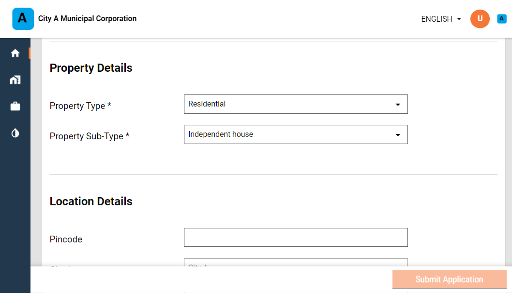
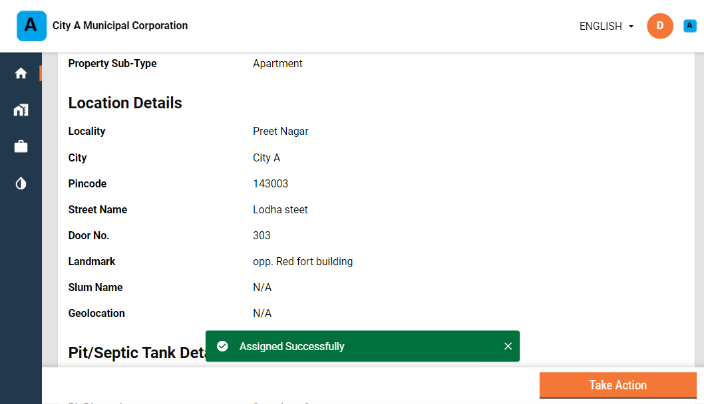

# Employee User Manual

ULB officials or employees receive the service requests and are responsible for routing these requests to specific DSOs.

Employees can -

1. Create Desludging application
2. Make payment
3. Update application / Generate Demand
4. Assign DSO to an application
5. Re-assign DSO to an application
6. Cancel the application
7. Reject the application

### Create Desludging Application

.png>)

Log in as employee FSM Creator role.

Click on the **Inbox** to view the list of applications created by the signed in user.

Click on **New Emptying of Septic Tank / Pit Application** option.

Select the relevant **Application Channel** to indicate the channel that the employee is using to create a new service request. The applicant may use the telephone to raise requests or the local office counter.

Enter the **Applicant Name** and **Applicant Mobile No.**

Select the relevant **Property Type** and **Property Sub Type**.

Enter the **Pincode**, **City**, **Locality/Mohalla**, **Slum Name**, **Street Name**, **Door No.** and **Landmark** details in the **Location** panel.

Select the applicable **Onsite Sanitation Type** from the drop down list. Enter the **Pit Dimension** or dimensions in meters for the selected sanitation type.

Select the **Vehicle Type** that will be required to fulfil this request. Enter the required **No. of Trips** and **Amount per Trip** details to calculate the **Total Amount** payable for the service request.

Click on the **Submit Application** button.

The application is submitted and an **Application No.** is generated. Click on the **Download** button on the screen to generate a pdf copy of the application for future reference.

The system will trigger notifications to the applicant mobile number with the application number and status updates.

### Update Application

Employees can update application details on behalf of the applicant.

Search for the application by the application number or any other search filter. Scroll down the application and click on the **Take Action** button. Click on **Update Application**. Make the required changes and resubmit it.

### Make Payment

Employees can collect the payment for the service requested at the counter. Payments can also be collected for applications raised by citizens online.

Navigate to the employee **Inbox**.

Search for the application in the inbox using the search filters provided. Fetch applications that has the status as **Pending for Payment.** Click on the relevant application to open it.

Scroll down the application and click on the **Take Action** button. Click on **Collect Payment.**

The payment details are available on the screen.

Enter the **Payer Details** to proceed with the payment. Select the **Paid By** option as **Other** in case the payment is not made by the applicant. Enter the **Payer Name** and **Payer Mobile No.** details. Else, select **Owner**. The applicant or **Payer Name** and **Payer Mobile No.** are auto-populated from the application.

Select the relevant **Payment Mode** and proceed with the payment details. Click on **Generate Receipt** once the payment is done.

The **Payment Collected** acknowledgement provides the payment **Receipt No.** Click on the **Print Receipt** button to print the receipt.

### Assign Requests to DSO

Employees assign the received service requests to relevant DSOs for action.

Search for applicants **Pending for DSO Assignment**. Click on the **Application No.** to open it.

Scroll down the application and click on the **Take Action** button. Click on **Assign DSO**.

The selected **Vehicle Type** and **Vehicle Capacity (Ltrs)** are auto-populated from the details entered in the application. Select the relevant DSO Name from the drop-down list. The list of DSOs is populated on the basis of the selected vehicle type.

The **Expected date of completion** shows the current date by default. Change this if required. Click on the **Assign** button.

The request is assigned to the selected DSO.

### Re-assign DSO

Employees can reassign to other DSOs in case the request has been rejected or declined by the DSO for some reason.

Search for applications **Pending for DSO Approval** status. Click on the relevant **Application No.** to open it.

Scroll down the application and click on **Take Action** button. Click on **Re-assign DSO**.

Select the applicable **Reason for Re-assign**. Select the relevant **DSO Name**. Update the **Expected date of completion** if required. Click on the **Reassign** button.

The DSO is reassigned successfully.

### Complete or Decline Request

Employees can complete or decline service requests on behalf of the DSO.

Search for application with the status as **DSO InProgress**. Click on the **Application No.** to open it.

.png>)

Scroll down the application and click on the **Take Action** button. Click on **Complete Request** or **Decline Request**. Fill in the request details on behalf of the DSO to complete or reject the request.

All content on this page by [eGov Foundation ](https://egov.org.in/)is licensed under a [Creative Commons Attribution 4.0 International License](http://creativecommons.org/licenses/by/4.0/).
