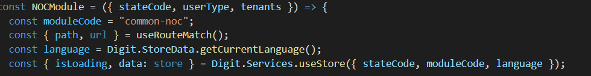

# NOC DIGIT UI

### Objective 

Enable users to apply or update NOC applications

### Localization 

Localization of the NOC module is through the _**common-noc**_ module.

> [\_\_](http://creativecommons.org/licenses/by/4.0/)_All content on this page by_ [_eGov Foundation_ ](https://egov.org.in/)_is licensed under a_ [_Creative Commons Attribution 4.0 International License_](http://creativecommons.org/licenses/by/4.0/)_._
