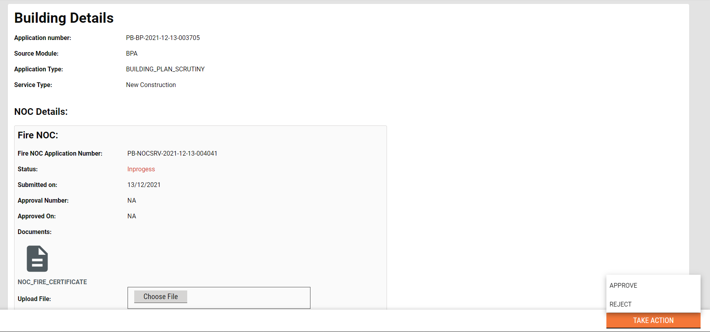
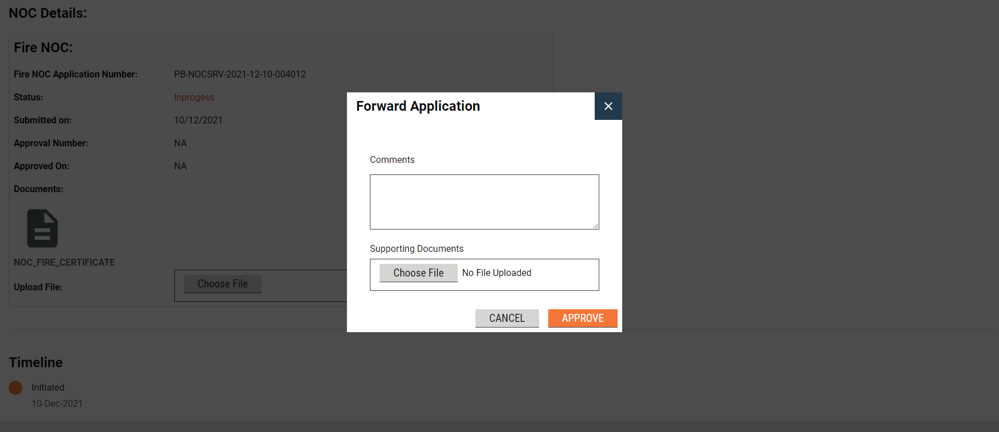

# Application Overview

## Overview

The application overview page shows the details of the application selected and the action that a specific user is allowed to take on that application.

## MDMS Details 

Documents required for NOC approval are gathered from [DocumentTypeMapping ](https://github.com/egovernments/egov-mdms-data/blob/DEV/data/pb/NOC/DocumentTypeMapping.json)MDMS.

Common documents that are required are fetched from [DocumentType ](https://github.com/egovernments/egov-mdms-data/blob/DEV/data/pb/common-masters/DocumentType.json)config from MDMS.&#x20;

## Workflow Actions

**Forward** application with the uploaded NOC certificate to forward the application to concerned authorities for approval.

**Reject** application to reject the application.

## Components 

For multiple uploading of documents, we have used **MultiUploadWrapper** which encapsulates API calls and abstracts the whole process providing the fileData and fileStoreIds.

> [\_\_](http://creativecommons.org/licenses/by/4.0/)_All content on this page by_ [_eGov Foundation_ ](https://egov.org.in/)_is licensed under a_ [_Creative Commons Attribution 4.0 International License_](http://creativecommons.org/licenses/by/4.0/)_._
