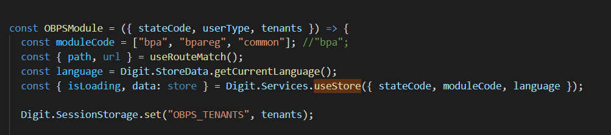

# Employee - Stakeholder

## Objective 

The employee stakeholder flow consists of 2 independent screens and 1 application details page. Users have access to this flow using links in the Inbox and the Search application page.

## Localization 

The localization module used in the OBPS module comprises rainmaker-bpareg and rainmaker-common. The rainmaker-bpareg is initialized for module localization.

## MDMS 

The stakeholder MDMS data is used to filter views and service types displayed on the screen in accordance with the existing user role. The [TradeTypeToRoleMapping ](https://github.com/egovernments/egov-mdms-data/blob/DEV/data/pb/StakeholderRegistraition/TradeTypetoRoleMapping.json)MDMS data is also used to filter views based on the selected business service.

## Roles 

User access to the stakeholder flows and BPAREG business service is role-based. Roles can be - `"BPAREG_EMPLOYEE", "BPAREG_APPROVER", "BPAREG_DOC_VERIFIER", "BPAREG_DOC_VERIFIER"`

&#x20;

>
