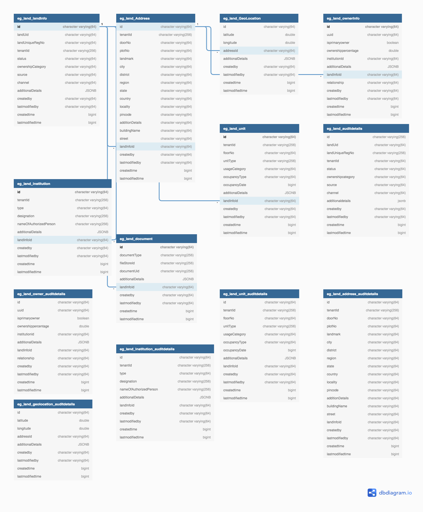

# Land Services

### Description <a href="#description" id="description"></a>

This service is the major service supporting bpa-services which handles the data of the land like land details, owner information, unit, address and documents which has the complete information of the land.

Which can be used as input for the bpa-services to create and process the Building Plan Application.

### Functionality <a href="#functionality" id="functionality"></a>

This section covers the high-level details of the functionalities available Land Service

* UI integrated as part of BPA screens
* Ability to create/update Land Details

### **System Requirements** <a href="#system-requirements" id="system-requirements"></a>

* Knowledge of Java/J2EE(preferably Java 8 version)
* Knowledge of Spring Boot and spring-boot microservices.
* Knowledge of Git or any version control system.
* Knowledge of RESTful Web services.
* Knowledge of the Lombok library will helpful.
* knowledge of eGov-mdms service, eGov-persister, eGov-idgen, eGov-user, eGov-localization will be helpful.

### **Setup and Usage** <a href="#setup-and-usage" id="setup-and-usage"></a>

The [**Application**](https://github.com/egovernments/municipal-services/tree/master) is present among the _**municipal services**_ group of applications available in the eGov-services git repository with the folder name **land-services**. The spring boot application needs the **Lombok\*** extension added in your IDE to load it. Once the application is up and running API requests can be posted to the URL and ids can be generated.

* in case of IntelliJ, the plugin can be installed directly, for eclipse the Lombok jar location has to be added in eclipse.ini file in this format javaagent:lombok.jar

### **API Information**

* Please refer to Swagger API for YAML file details. Link - [API Specs](https://github.com/egovernments/municipal-services/blob/master/docs/bpa/bpa-service.yaml).

#### _**Application.properties File Information**_

Here we are listing the configs apart from dependent service host, url’s, DB and Flyway configs.

* kafka topics persister configs for eGov persister to save and update land Data
  * persister.save.landinfo.topic=save-landinfo
  * persister.update.landinfo.topic=update-landinfo

### **External API References** <a href="#external-api-references" id="external-api-references"></a>

* **egov-user** - ( Manage user )
* **egov-filestore** ( To store the documents uploaded by the user )
* **egov-idgen** ( To generate the application No, Permit No )
* **egov-indexer** ( To index the bpa data )
* **egov-localization** ( To use the localized messages )
* **egov-location** ( To store the address locality )
* **egov-mdms** ( Configurations/master data used in the application is served by MDMS )
* **egov-persister** ( Helps to persist the data )

### **Configuration** <a href="#configuration" id="configuration"></a>

#### _**Land Service Specific MDMS configuration**_**:** <a href="#land-service-specific-mdms-configuration" id="land-service-specific-mdms-configuration"></a>

There is not MDMS config for Land Service exists as of now.

Access MDMS Config

**Action Test : URL Actions adding**

[action-test.json](https://github.com/egovernments/egov-mdms-data/blob/master/data/pb/ACCESSCONTROL-ACTIONS-TEST/actions-test.json)\`\`

```
  {
      "id": 1988,
      "name": "BPA-Land-Create",
      "url": "/land-services/v1/land/_create",
      "displayName": "Land Create",
      "orderNumber": 0,
      "enabled": false,
      "serviceCode": "BPA",
      "code": "null",
      "path": ""
    },
    {
      "id": 1989,
      "name": "BPA-Land-Update",
      "url": "/land-services/v1/land/_update",
      "displayName": "Land Update",
      "orderNumber": 0,
      "enabled": false,
      "serviceCode": "BPA",
      "code": "null",
      "path": ""
    },
    {
      "id": 1990,
      "name": "BPA-Land-Search",
      "url": "/land-services/v1/land/_search",
      "displayName": "Land Search",
      "orderNumber": 0,
      "enabled": false,
      "serviceCode": "BPA",
      "code": "null",
      "path": ""
    },
```

**Access to the Roles for the above Actions**

[roleacton.json](https://github.com/egovernments/egov-mdms-data/blob/master/data/pb/ACCESSCONTROL-ROLEACTIONS/roleactions.json)\`\`

```
{
      "rolecode": "BPA_ARCHITECT",
      "actionid": 1988,
      "actioncode": "",
      "tenantId": "pb"
    },
      {
      "rolecode": "BPA_ARCHITECT",
      "actionid": 1989,
      "actioncode": "",
      "tenantId": "pb"
    },
    {
      "rolecode": "CITIZEN",
      "actionid": 1989,
      "actioncode": "",
      "tenantId": "pb"
    },
    {
      "rolecode": "BPA_VERIFIER",
      "actionid": 1989,
      "actioncode": "",
      "tenantId": "pb"
    },
    {
      "rolecode": "BPA_APPROVER",
      "actionid": 1989,
      "actioncode": "",
      "tenantId": "pb"
    },
    {
      "rolecode": "BPA_FIELD_INSPECTOR",
      "actionid": 1989,
      "actioncode": "",
      "tenantId": "pb"
    },
    {
      "rolecode": "BPA_NOC_VERIFIER",
      "actionid": 1989,
      "actioncode": "",
      "tenantId": "pb"
    },
    {
      "rolecode": "BPA_FIELD_INSPECTOR",
      "actionid": 1990,
      "actioncode": "",
      "tenantId": "pb"
    },
    {
      "rolecode": "BPA_NOC_VERIFIER",
      "actionid": 1990,
      "actioncode": "",
      "tenantId": "pb"
    },
    {
      "rolecode": "BPA_ARCHITECT",
      "actionid": 1990,
      "actioncode": "",
      "tenantId": "pb"
    }, {
      "rolecode": "BPA_VERIFIER",
      "actionid": 1990,
      "actioncode": "",
      "tenantId": "pb"
    },
    {
      "rolecode": "CEMP",
      "actionid": 1990,
      "actioncode": "",
      "tenantId": "pb"
    },
    {
      "rolecode": "BPA_APPROVER",
      "actionid": 1990,
      "actioncode": "",
      "tenantId": "pb"
    },
    {
      "rolecode": "CITIZEN",
      "actionid": 1990,
      "actioncode": "",
      "tenantId": "pb"
    }
```

#### _**Persister configuration**_ <a href="#persister-configuration" id="persister-configuration"></a>

[Land Persister YAML](https://github.com/egovernments/configs/blob/master/egov-persister/land-persister.yml)

#### Database Schema <a href="#database-schema" id="database-schema"></a>



#### Workflow Configuration <a href="#workflow-configuration" id="workflow-configuration"></a>

NA

#### Notifications <a href="#notifications" id="notifications"></a>

NA

#### PDF Used <a href="#pdf-used" id="pdf-used"></a>

NA

[](http://creativecommons.org/licenses/by/4.0/)All content on this page by [eGov Foundation ](https://egov.org.in/)is licensed under a [Creative Commons Attribution 4.0 International License](http://creativecommons.org/licenses/by/4.0/).
