# PT - Create Property UI Details

## Overview

This page provides detailed UI information on the Create Property feature available in the Property Tax module.

The objective is to provide user facilities to add a new property, view the property details and the application currently on their number. The feature allows users to update the property or edit the application.

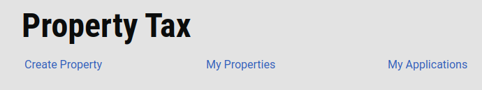

## **Create Property**

Users can add new property using the Create Property button, and while going through the workflow, can add all the valid information, according to the question asked. At the end of the flow, a Check page will be displayed on which the user can cross verify the information entered. On submitting, the application is created.

**Create Property Flow**

Property Tax information screen will be displayed after login, which helps the user to understand the necessary documents needed to complete the new registration for the property.

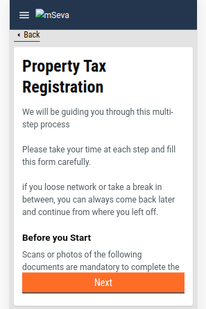

**Property Details Flow**

The user needs to enter the details about the property first. Below is the flow chart for the property details flow\*\*.\*\*

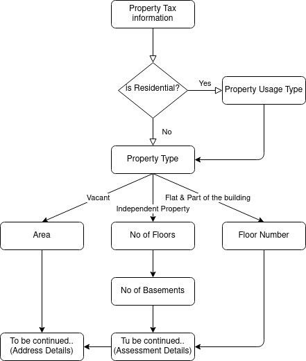

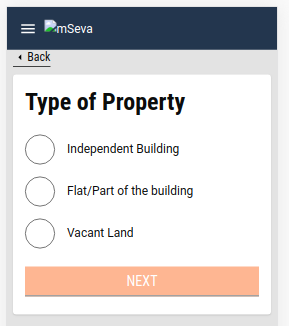

**Assessment Details Flow**

Then the user will be asked about the assessment details, which contains information about each floor and basement.

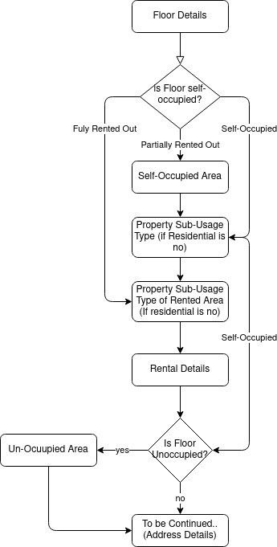

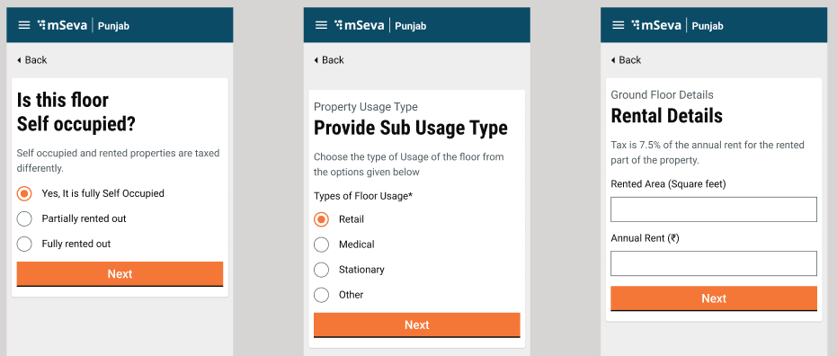

**Address Details Flow**

After entering the details of the property, the user needs to enter the address of the property, where it is located. The flow is straightforward, without any conditional routing.

Users can pinpoint the location in the Geo-location map, according to which pin code and city, as well as locality, is auto-populated.

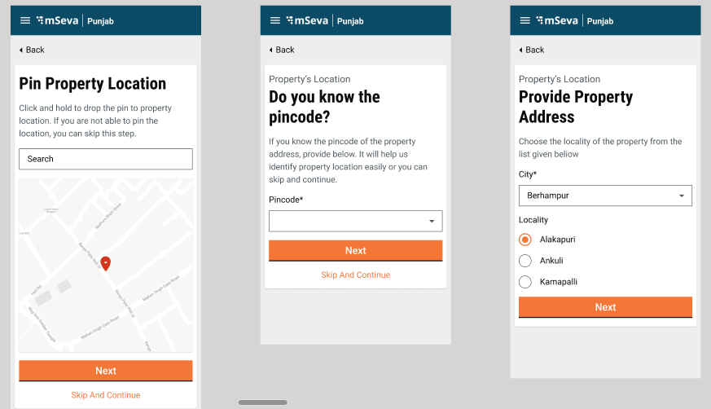

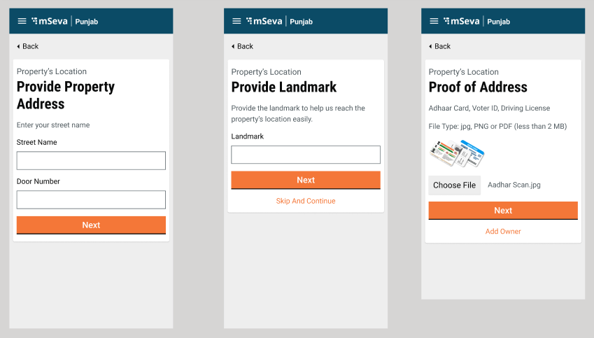

**Owner Details Flow**

Finally, the user needs to enter the details, about the property owner, it can be institutional - (Government/ Private) or Single/Multiple Owner. According to which the details will be filled.

In the case of Institutional, the following data will be asked in the first screen, and the following screen will remain the same.

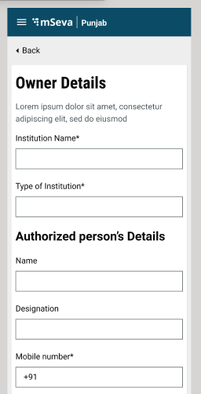

In the case of a single/Multiple Owner following screen will be displayed, rest flow will remain the same.

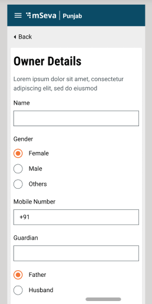

**Check Page and Acknowledgement Screen**

Users can cross-verify the data entered throughout the flows in the Check page. Click on the change button adjacent to the relevant data allows users to change/update the entered data. The user is redirected to the relevant page where data needs to be changed. Repeat the successive flows to submit the application.

For Registration of property, Create API is called. Following is the snippet of the Create API used:`1create: "/property-services/property/_create"`

If the API response is successful, then the Acknowledgement Screen is displayed, otherwise Failed Acknowledgement Screen is displayed.

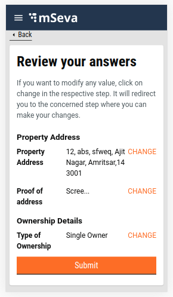

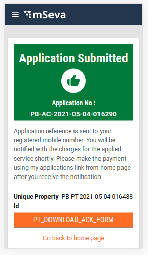

## **Technical Implementation Details**

All the screens have been developed using the new-UI structure followed previously in FSM and PGR.

The link for the Create Property Main Index is given below, it can be used to understand the starting point of the flow:

[https://github.com/egovernments/digit-ui-internals/blob/development/packages/modules/pt/src/pages/citizen/Create/index.js](https://github.com/egovernments/digit-ui-internals/blob/development/packages/modules/pt/src/pages/citizen/Create/index.js)

PT (Property Tax) Module has been segregated into a specified structure. All the screen configuration is inside PageComponent Folder, and the configuration for routing of the pages are mentioned in the config folder which is common for both Citizen as well as Employee. The snippet for folder structure and routing configuration is given below.

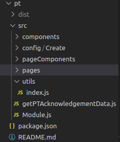

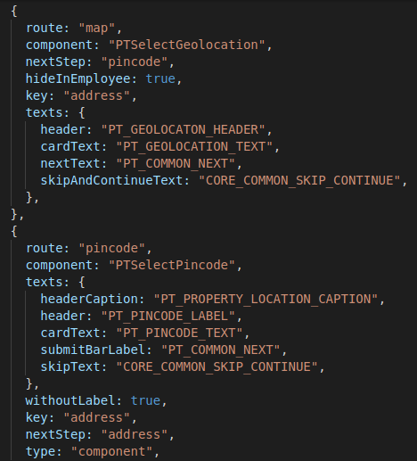

Pages Folder is where the high-level configuration for controlling the whole flow is mentioned, for citizens and employees. Citizen flows include Create, Edit, My Properties, My Application and Search Property. The search property flow carries the index (the main starting point of the whole flow).

After completing the flow the user can download the acknowledgement PDF form of the property created. Click [here to find](https://github.com/egovernments/digit-ui-internals/blob/development/packages/modules/pt/src/getPTAcknowledgementData.js) the config for the PDF generation.

Utils Folder basically contains all the methods which are being used throughout the PT module. In case any common method needs to be declared here, it can be imported into other files.

For creating an Application the Create API from Property Tax is being called using the React hooks, which has been declared under hooks/elements/PT as PTService.

## **MDMS Data**

Throughout the flows, data across a few pages are imported from MDMS. Following is the list of pages that are using MDMS data. These pages .js files can be found under page components.

| S.No. | PageComponent            | MDMS Detail                                                                                                       | Module Detail Name | Master Detail Name  |
| ----- | ------------------------ | ----------------------------------------------------------------------------------------------------------------- | ------------------ | ------------------- |
| 1     | PropertyTax              | List of documents required for each category                                                                      | `PropertyTax`      | `Documents`         |
| 2     | PropertyUsageType        | Four category imported - (Commercial, industrial, institutional & others)                                         | `PropertyTax`      | `UsageCategory`     |
| 3     | PropertyType             | three major categories - (Independent, Flat & Part of the building & Vacant)                                      | `PropertyTax`      | `PropertyType`      |
| 4     | SubUsageType             | List of sub-usage category according to the property usage selected before                                        | `PropertyTax`      | `UsageCategory`     |
| 5     | SubUsageTypeOfRentedArea | List of sub-usage category according to the property usage category selected before, same as sub-usage type       | `PropertyTax`      | `UsageCategory`     |
| 6     | PTSelectAddress          | List of Cities (Amritsar, Jalandhar and Nawanshahr) and List of localities according to the city selected         | `PropertyTax`      | `tenants`           |
| 7     | OwnershipDetails         | Four categories imported - (Institutional - private, Institutional - Government, Single Owner and multiple Owner) | `PropertyTax`      | `OwnerShipCategory` |
| 8     | SpecialOwnerCategory     | List of special category imported eg Freedomfighter, handicap etc                                                 | `PropertyTax`      | `OwnerType`         |
| 9     | PTGeolocation            | Default value for location i.e Pratap Nagar Latitude and longitude                                                | `PropertyTax`      | `MapConfig`         |
| 10    | RentalDetails            | Rentaldetails information regarding tax percentage is taken from MDMS                                             | `PropertyTax`      | `RentalDetails`     |

Data React Hooks are used for calling MDMS, so that it could be shared throughout the modules.

Below is the little code snippet for the call used for MDMS.

```
const { data: OwnerShipCategoryOb } = Digit.Hooks.pt.usePropertyMDMS(stateId, "PropertyTax", "OwnerShipCategory");
```

## **Localization**

Localization keys are added under the ‘_rainmaker-pt_’ locale module. In future, if any new labels are implemented in the Property Tax (Citizen) they should also be pushed in the locale DB under _rainmaker-pt_ locale module. Below is an example of few locale labels.

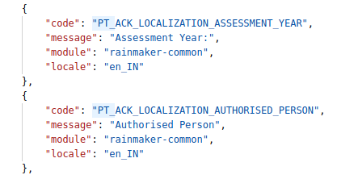

## **API Call Role Action Mapping**

|       |                                        |               |           |
| ----- | -------------------------------------- | ------------- | --------- |
| S.No. | **API**                                | **Action Id** | **Roles** |
| 1     | /access/v1/actions/mdms/\_get          | 870           | CITIZEN   |
| 2     | /egov-mdms-service/v1/\_search         | 954           | CITIZEN   |
| 3     | /localization/messages/v1/\_search     | 1531          | CITIZEN   |
| 4     | /property-services/property/\_create   | 1895          | CITIZEN   |
| 5     | /property-services/property/\_search   | 1897          | CITIZEN   |
| 6     | /property-services/property/\_update   | 1896          | CITIZEN   |
| 7     | /property-services/assessment/\_search |               | CITIZEN   |
| 8     | /billing-service/bill/v2/\_fetchbill   |               | CITIZEN   |

## Documents and Resource Links

| Link                                                                                         | Description                             |
| -------------------------------------------------------------------------------------------- | --------------------------------------- |
| [My Applications](property-tax-my-applications.md)                                           | Property applications                   |
| [My Properties](property-tax-my-properties.md)                                               | Registered properties                   |
| [Application Details](property-tax-my-applications.md)                                       | Application details                     |
| [Property Information](../property-tax-service/property-mutation-and-mutation-calculator.md) | Property information                    |
| [Edit/Update Property](edit-update-property.md)                                              | Edit or update property details         |
| [Quick Pay and Search Property](property-tax-quick-pay-for-citizen.md)                       | Make payment or search property details |

> [](http://creativecommons.org/licenses/by/4.0/)_All content on this page by_ [_eGov Foundation_ ](https://egov.org.in/)_is licensed under a_ [_Creative Commons Attribution 4.0 International License_](http://creativecommons.org/licenses/by/4.0/)_._
