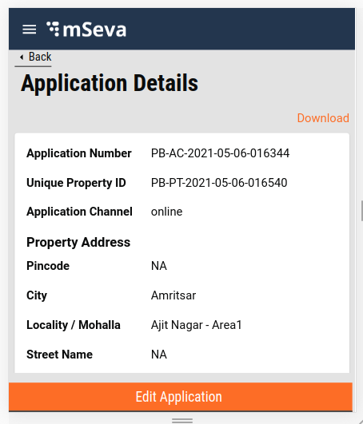
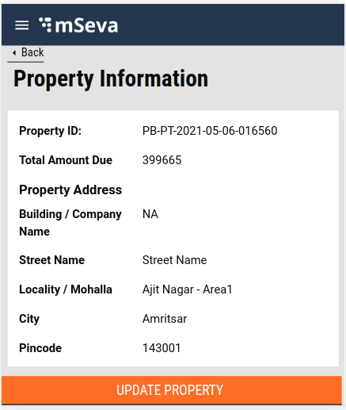
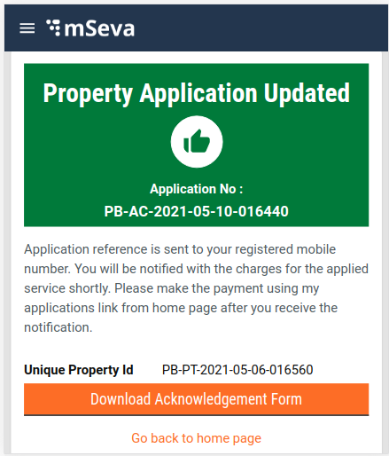

# Edit-Update Property

## **Overview**

This page provides information and details for edit and updates property feature in the PT module. This feature allows the user to edit the application already created or update the property already registered with their mobile number. After verification, the employee can send the application back to the citizen with remarks on any required changes. The edit and update feature allows the users to make these changes. It also allows the user to update the details of the property details online if there are any such upgrades or changes.

## Edit A**pplication**

On the Application details page, on the employee side, if the property is marked with “Send Back to Citizen”, the edit option will appear dynamically at the end of the page and will be static in nature.

## Update Property

On the Property details page, on the employee side, if the property is marked with Verify → forward → approved, the Update option will appear dynamically at the end of the page and will be static in nature.

On clicking the Update button, users can edit/update the property details by going through the Create flow again. The only exception here is the values will be pre-populated from the Property object received from Property Search API. On completing the flow the Update API is called and the property is updated successfully.

Acknowledgement screen

## **Technical Implementation Details**

[Click here ](https://github.com/egovernments/digit-ui-internals/blob/development/packages/modules/pt/src/pages/citizen/EditProperty/index.js)to access the Edit/Update property main index.

The main code contains the functions that transform the property object received in Search API to the object. This includes primarily the Assessment flow units suitable for the Create flow since the user has to go through Create flow again with pre-populated details and update the value of the data accordingly. It also contains the routing details for the pages in the Create flow.

Update Util function: this function does the exact opposite of the Create util function \(refer[ Property Tax - My Applications](https://digit-discuss.atlassian.net/wiki/spaces/DD/pages/1568899109/Property+Tax+-+My+Applications) \). The property object which is received from the Property Search API is converted to the Create flow relevant structure so that the values can be pre-populated for the user convenience, on completing the flow, the application is updated. The link for the same [is available here](https://github.com/egovernments/digit-ui-internals/tree/development/packages/modules/pt/src/utils).

## **MDMS**

MDMS data used here is the same as the Create flow since the flow structure used for edit/update property is the same as the create property flow. Please refer to the [link here for detailed MDMS information](./).

## **Localization**

For Edit/Update Property also, the Localization keys are being added in the ‘_rainmaker-pt_’ locale module. To change, update or adding of any new localization key will be done in the same locale module only.

> _All content on this page by_ [_eGov Foundation_ ](https://egov.org.in/)_is licensed under a_ [_Creative Commons Attribution 4.0 International License_](http://creativecommons.org/licenses/by/4.0/)_._

