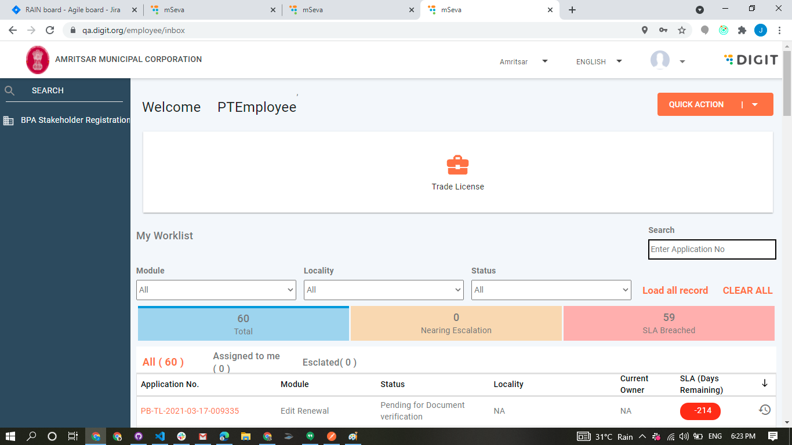
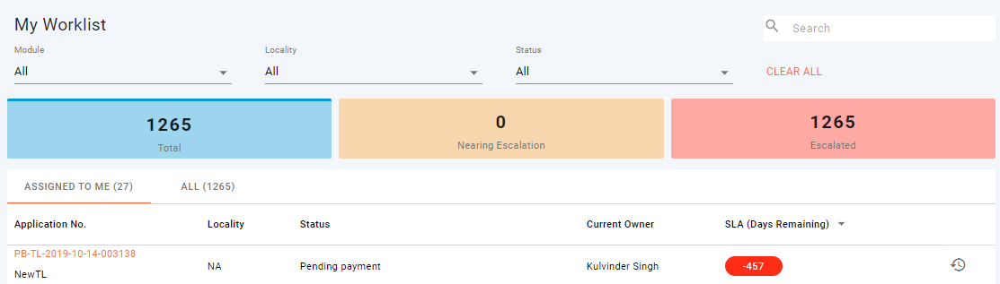
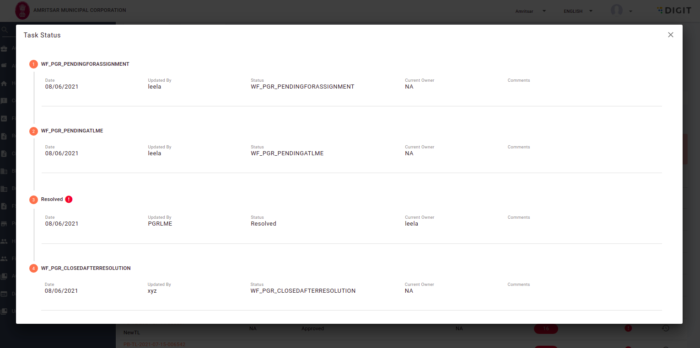

# Employee Inbox (Old UI)

## **Objective**

Provide employees with the options to view the assigned, escalated applications and the applications that are pending for action.

Route - [mSeva](https://qa.digit.org/employee/inbox)



## **Technical Implementation Details**

Inbox screen is loaded based on the file [frontend/index.js at master · egovernments/frontend](https://github.com/egovernments/frontend/blob/master/web/rainmaker/packages/employee/src/modules/employee/Inbox/index.js)

Inbox screen can be divided into 4 sub components as listed below:

1. Sidebar
2. Quick action button
3. Service List
4. Inbox worklist

### **Sidebar**

Action Menu is the component that shows the menu items in the sidebar based on the response from the `access/v1/actions/mdms/_get` API .

Action Menu component file is present in[frontend/index.js at master · egovernments/frontend](https://github.com/egovernments/frontend/blob/master/web/rainmaker/dev-packages/egov-ui-kit-dev/src/common/common/ActionMenu/index.js). Based on the response the actions gets filtered based on the condition in `navigationURL`

### **Quick action**

Quick Action button which shows the menu based on the response from the `access/v1/actions/mdms/_get` API.

The quick Action button is present in [frontend/index.js at master · egovernments/frontend](https://github.com/egovernments/frontend/blob/master/web/rainmaker/dev-packages/egov-ui-framework-core/src/ui-molecules/MenuButton/index.js). Based on the response the actions get filtered based on the condition `item.url === "quickAction"`

### **Service List**

Service List is the component that shows the menu based on the response from the `access/v1/actions/mdms/_get` API.

[frontend/index.js at master · egovernments/frontend](https://github.com/egovernments/frontend/blob/master/web/rainmaker/dev-packages/egov-ui-kit-dev/src/common/common/ServiceList/index.js) based on the response the actions get filtered based on the condition `item.url === "card"`

### **Inbox Worklist**

Inbox worklist is the component that shows the records based on the response from the `/egov-workflow-v2/egov-wf/process/_search` API.



Inbox worklist contains options to filter and search the records based on the options.



Fetching all the records from the process instance is not made in a single call since we might fetch a lot of records. So we make a call to get the total count from `egov-workflow-v2/egov-wf/process/_count` API. After that, we load the initial records for all business services.&#x20;

Once all the records are fetched the system loads the locality of the records based on the locality search provided by the service (BUSINESS SERVICE).

### **Assigned To Me Tab**

The Assigned To Me Tab displays all assigned applications for the logged-in user.

All records are fetched from the process instance response that filters the records based on the following condition:

`1get(item, 'assignes[0].uuid')=== uuid;`

Here, the UUID is the logged-in Employees User id and the item is the total records.

### **SLA**

SLA of the Application is based on the `businesssServiceSla` and it is converted using the following conversion:

`item.businesssServiceSla / (1000 * 60 * 60 * 24)`

### **Nearing Escalation And Escalated**

Nearing Escalation and Escalated is identified based on the `businesssServiceSla` present in that record and the configured MDMS data `wfSlaConfig`

It contains the slot colour and percentage.

### **Pagination**

Pagination is configured in the MDMS to hold default records and default options to show rows per page.


Table and Table pagination can be accessed from this file link below.



## MDMS config

[egov-mdms-data/TablePaginationOptions.json at 77f19c91861fab275c1b22d5063f69b4099bda15 · egovernments/egov-mdms-data](https://github.com/egovernments/egov-mdms-data/blob/77f19c91861fab275c1b22d5063f69b4099bda15/data/pb/common-masters/TablePaginationOptions.json)

```
{
    "tenantId": "pb",
    "moduleName": "common-masters",
    "TablePaginationOptions": [
        {
            "rowsPerPageOptions": [25, 50, 100],
            "defaultValue": 100
        }
    ]
}


```

### **Application Redirection**

In every row, there is an option to view or perform an action on the record and this redirects users to the relevant module.

These details are configured in `CommonInboxConfig` MDMS [egov-mdms-data/CommonInboxConfig.json at e8b7bad5ad7c4e17816dedb673b2f4085c92c8a6 · egovernments/egov-mdms-data](https://github.com/egovernments/egov-mdms-data/blob/e8b7bad5ad7c4e17816dedb673b2f4085c92c8a6/data/pb/common-masters/CommonInboxConfig.json)

Refer to the Config below.

```
 "tenantId": "pb",
    "moduleName": "common-masters",
    "CommonInboxConfig": [{
            "moduleName": "PT",
            "BusinessService": "PT.CREATE",
            "roles": ["PT_CEMP", "PT_DOC_VERIFIER","PT_FIELD_INSPECTOR","PT_APPROVER"],
            "active": false,
            "locality":false,
            "localityModule":"property-services",
            "redirectConfig": {
                "INITIATED": "/employee/property-tax/application-preview?applicationNumber=^WFBID^&tenantId=^WFTNID^&type=property",
                "DEFAULT": "/employee/property-tax/application-preview?applicationNumber=^WFBID^&tenantId=^WFTNID^&type=property"
              }
        },
```

Redirection for every module should be configured in `redirectConfig`and similarly for any other config like active, locality, and locality modules.

### **Escalated Tab**

Here in Escalated tab, it makes an escalation search, using `egov-workflow-v2/egov-wf/escalate/_search.`The object structure is similar to the process search.

On View History - It shows which state has it got escalated using flag. `isEscalatedApplication`based on it it shows a red mark for the corresponding state.

Functionality file path: [frontend/index.js at master · egovernments/frontend](https://github.com/egovernments/frontend/blob/master/web/rainmaker/packages/employee/src/modules/employee/Inbox/components/Table/index.js)



### **Filter Options**

Here all the filter options are derived from the records that we receive through the process instances. It is not from any MDMS data.&#x20;

## **Role Action Mapping**

| [**S.NO**](http://s.no/) | **API**                                            | **ROLES**  | **ACTION ID** |
| ------------------------ | -------------------------------------------------- | ---------- | ------------- |
| 1                        | `egov-mdms-service/v1/_search`                     |            | `954`         |
| 2                        | `access/v1/actions/mdms/_get`                      |            | `870`         |
| 3                        | `egov-workflow-v2/egov-wf/process/_count`          | `EMPLOYEE` | `2027`        |
| 4                        | `egov-workflow-v2/egov-wf/process/_search`         | `EMPLOYEE` | 1730          |
| 5                        | `egov-workflow-v2/egov-wf/businessservice/_search` | `EMPLOYEE` | `1743`        |
| 6                        | `egov-workflow-v2/egov-wf/escalate/_search`        | `EMPLOYEE` | `2168`        |

&#x20;

> [_​_](http://creativecommons.org/licenses/by/4.0/)_All content on this page by_ [_eGov Foundation_](https://egov.org.in/) _is licensed under a_ [_Creative Commons Attribution 4.0 International License_](http://creativecommons.org/licenses/by/4.0/)_._
