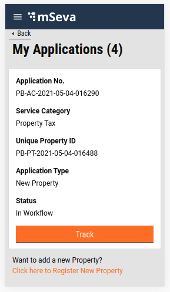
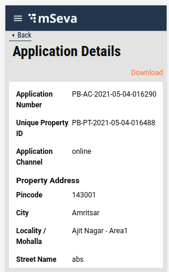
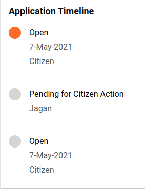

# Property Tax - My Applications

## **Overview**

This page provides the user interface and API details for My Applications feature in the PT module. Users can review the list of applications and their status registered under their mobile number in the My Applications tab. Initially, only four application will load at once. If the user wants to look for more, the “Load More” option needs to be clicked. Each Application for the initial view will display Application No, Service Category, Property Id, Application Type and status, with Track option, that enables the user to look up more details about the Application. If a user is unable to find their property details on the system, a new Application can be raised using the link provided at the bottom of the page.



Once the user clicks on the Track Button, the Application Details Page is displayed with all the necessary information about the application.



**Timeline component:** The timeline component is present at the end of the application details which tells about the current status and history of the application passing through various workflows and actions taken.



## **Technical Implementation Details**

[Click here to fetch the working code](https://github.com/egovernments/digit-ui-internals/blob/development/packages/modules/pt/src/pages/citizen/PTMyApplications/index.js) details for My Applications and Application Details common Index.

The template for My Application is present under pt/pages/citizen/PTMyApplications and the Application Details page is present inside pt/pages/citizen named as PTApplicationDetails. The list of Applications is retrieved by calling the search API "/property-services/property/\_search"

This API is called using the React hook present inside the index of PTMyapplication and PTApplicationDetails page, a single application is being loaded, bypassing the unique Property Id in the search API.

Following is the hook used for the property search API.

```
const { isLoading, isError, error, data } = Digit.Hooks.pt.usePropertySearch(tenantId);
```

**Create and Update Util Function**

The two main util function and the objective of it are given below:

Create Util Function: While going through the Create flow, all the inputs that the user has entered are stored in a different structure. Since the units are not separated in the flow but incorporated according to each ground, the storing structure is different from the request body of Create API. This function transforms the flow of stored data into the requested body format.

[Click here](https://github.com/egovernments/digit-ui-internals/tree/development/packages/modules/pt/src/utils) to fetch the code.

[Update Util Function: ](edit-update-property.md)Click here to find detailed information about this function.

## **MDMS**

No MDMS data is used here, all the data is being loaded from Search API.

## **Localization**

For My Applications also the Localization keys are added in the ‘_rainmaker-pt_’ locale module same as My properties and create. To change, update or add any new localization key is done in the same locale module only.

> [\_\_](http://creativecommons.org/licenses/by/4.0/)_All content on this page by_ [_eGov Foundation_ ](https://egov.org.in/)_is licensed under a_ [_Creative Commons Attribution 4.0 International License_](http://creativecommons.org/licenses/by/4.0/)
