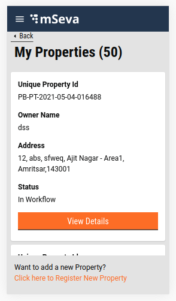
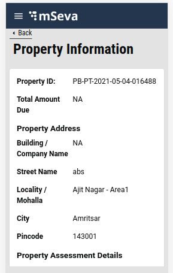

# Property Tax - My Properties

## **Overview**

Users can look for the list of the properties registered under their mobile number in My Properties Tab. Each Property for the initial view will display Property Id, Owner Name, Address and status, with view details option, through which User can look up more details about the property registered. If users do not find the property looking for, new property can be registered using the below link “Click here to register new Property”.



Once the user clicks on View Details, the Property Information Page is displayed with all the necessary information about the property.



## **Technical Implementation Details**

[Click here to fetch the working code](https://github.com/egovernments/digit-ui-internals/blob/development/packages/modules/pt/src/pages/citizen/MyProperties/index.js) for the My Properties and Property Details common Index.

The template for My properties and Property Information page is present inside pt/pages/citizen/MyProperties. The list of properties is retrieved by calling the search API "/property-services/property/\_search".

This API is called using the React hook present inside the index of My Properties and Property information page, a single property is being loaded, bypassing the unique Property Id in the search API.

If search API result is successful, Assessment Search API is called to know the assessment status i.e /property-services/assessment/\_search.

If the assessment object returned fetches assessment array details then the fetch bill API is called in order to retrieve the payment details for the particular property. API is /billing-service/bill/v2/\_fetchbill

Following is the hook used for the property search API, assessment search and fetch bill.

```
const { isLoading, isError, error, data } = Digit.Hooks.pt.usePropertySearch(tenantId);
const assessmentData = await Digit.PTService.assessmentSearch({ tenantId, filters: { propertyIds } });
billData = await Digit.PaymentService.fetchBill(tenantId, {
     businessService: "PT",
     consumerCode: propertyIds,
   });
```

## **MDMS**

No MDMS data is used here, all the data is loaded from Search API.

## **Localization**

For My Properties also the Localization keys are added to the ‘_rainmaker-pt_’ locale module. To change, update or add, any new localization key is done in the same locale module only.

> [\_\_](http://creativecommons.org/licenses/by/4.0/)_All content on this page by_ [_eGov Foundation_ ](https://egov.org.in/)_is licensed under a_ [_Creative Commons Attribution 4.0 International License_](http://creativecommons.org/licenses/by/4.0/)
