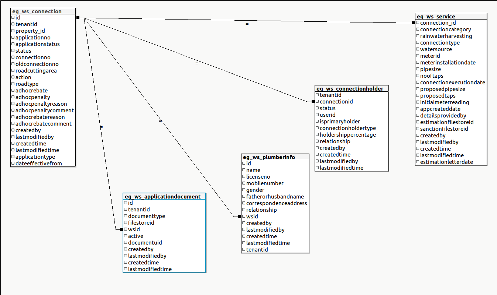

# Water Services

## Overview

Water service is the egov application, which helps and gives flexibility to municipal and citizen to handle the water service like apply for water connection, search water connection. The application will go on different stages that the state can verify by given roles, If that role can take the action then the application will go to the next state. Based on the state, a citizen will get a notification (SMS and in-app ). Citizens also can pay for application fees or employees can collect the fee for the application.

## Pre-requisites

Before you proceed with the documentation, make sure the following pre-requisites are met -

* _Java 8_
* Kafka server is up and running
* egov-persister service is running and has water service persister config path added in it
* PSQL server is running and database is created to store water connection / application data
* knowledge of eGov-mdms service, eGov-persister, eGov-idgen, eGov-sms, eGov-email,eGov-user, eGov-localization, eGov-workflow-service will be helpful.

## Key Functionalities

* Apply for _**a**_ water connection.
* Searching for water connections.
* Apply for Property creation.
* Can take different action based on state (Workflow)
* Notification based on the application state.

|                                                        |                                                                                                                               |
| ------------------------------------------------------ | ----------------------------------------------------------------------------------------------------------------------------- |
| **Environment Variables**                              | **Description**                                                                                                               |
| egov.waterservice.createwaterconnection                | This variable contains the kafka topic name which is used to create new water connection application in the system.           |
| egov.waterservice.updatewaterconnection                | This variable contains the kafka topic name which is used to update the existing water connection application in the system.  |
| egov.waterservice.updatewaterconnection.workflow.topic | This variable contains the kafka topic name which is used to update the process instance of the water connection application. |
| egov.idgen.wcapid.name                                 | This variable contain the idgen format name for water application                                                             |
| egov.idgen.wcapid.format                               | This variable contain the idgen format for water application ex:- WS/\[CITY.CODE]/\[fy:yyyy-yy]/\[SEQ\_EGOV\_COMMON]          |
| egov.idgen.wcid.name                                   | This variable contain the idgen format name for water connection                                                              |
| egov.idgen.wcid.format                                 | This variable contain the idgen format for water connection ex:- WS\_AP/\[CITY.CODE]/\[fy:yyyy-yy]/\[SEQ\_EGOV\_COMMON]       |

### Interaction Diagram <a href="#interaction-diagram" id="interaction-diagram"></a>

To Do

_**Table UML diagram**_



_\*\*\*\*_

## Configuration Details

_**M**_**DMS** _**configuration**_

[https://github.com/egovernments/egov-mdms-data/tree/DEV/data - Connect to preview](https://github.com/egovernments/egov-mdms-data/tree/DEV/data)\`\`

```
ws-services-calculation
ws-services-masters
PropertyTax
```

master-config.json for water service

```
"ws-services-masters": {
    "connectionCategory": {
      "masterName": "connectionCategory",
      "isStateLevel": true,
      "uniqueKeys": [
        "$.code"
      ]
    },
    "connectionType": {
      "masterName": "connectionType",
      "isStateLevel": true,
      "uniqueKeys": [
        "$.code"
      ]
    },
    "waterSource": {
      "masterName": "waterSource",
      "isStateLevel": true,
      "uniqueKeys": [
        "$.code"
      ]
    },
    "billingPeriod": {
      "masterName": "billingPeriod",
      "isStateLevel": true,
      "uniqueKeys": [
        "$.billingCycle"
      ]
    },
    "waterSourceWithSubSource": {
      "masterName": "waterSourceWithSubSource",
      "isStateLevel": true,
      "uniqueKeys": []
    }
  },
  "ws-services-calculation": {
    "WaterCess": {
      "masterName": "WaterCess",
      "isStateLevel": true,
      "uniqueKeys": []
    },
    "Interest": {
      "masterName": "Interest",
      "isStateLevel": true,
      "uniqueKeys": [
        "$.fromFY"
      ]
    },
    "Rebate": {
      "masterName": "Rebate",
      "isStateLevel": true,
      "uniqueKeys": [
        "$.fromFY"
      ]
    },
    "Penalty": {
      "masterName": "Penalty",
      "isStateLevel": true,
      "uniqueKeys": [
        "$.fromFY"
      ]
    },
    "WCBillingSlab": {
      "masterName": "WCBillingSlab",
      "isStateLevel": true,
      "uniqueKeys": []
    },
    "WS_CHARGE": {
      "masterName": "WS_CHARGE",
      "isStateLevel": true,
      "uniqueKeys": []
    },
    "WS_TIME_PENALTY": {
      "masterName": "WS_TIME_PENALTY",
      "isStateLevel": true,
      "uniqueKeys": []
    },
    "WS_WATER_CESS": {
      "masterName": "WS_WATER_CESS",
      "isStateLevel": true,
      "uniqueKeys": []
    },
    "MeterStatus": {
      "masterName": "MeterStatus",
      "isStateLevel": true,
      "uniqueKeys": []
    },
    "WS_Round_Off": {
      "masterName": "WS_Round_Off",
      "isStateLevel": true,
      "uniqueKeys": []
    },
    "PlotSizeSlab": {
      "masterName": "PlotSizeSlab",
      "isStateLevel": true,
      "uniqueKeys": []
    },
    "PropertyUsageType": {
      "masterName": "PropertyUsageType",
      "isStateLevel": true,
      "uniqueKeys": []
    },
    "FeeSlab": {
      "masterName": "FeeSlab",
      "isStateLevel": true,
      "uniqueKeys": []
    },
    "RoadType": {
      "masterName": "RoadType",
      "isStateLevel": true,
      "uniqueKeys": []
    },
    "CalculationAttribute": {
      "masterName": "CalculationAttribute",
      "isStateLevel": true,
      "uniqueKeys": []
    }
  }
```

Property creation through WNS module\
[https://github.com/egovernments/egov-mdms-data/blob/DEV/data/pb/PropertyTax/PTWorkflow.json](https://github.com/egovernments/egov-mdms-data/blob/DEV/data/pb/PropertyTax/PTWorkflow.json)

_**Persister configuration**_

[https://github.com/egovernments/configs/blob/DEV/egov-persister/water-persist.yml](https://github.com/egovernments/configs/blob/DEV/egov-persister/water-persist.yml)\
[https://github.com/egovernments/configs/blob/master/egov-persister/water-meter.yml](https://github.com/egovernments/configs/blob/master/egov-persister/water-meter.yml)

#### Actions & Role Action Mapping <a href="#actions-and-role-action-mapping" id="actions-and-role-action-mapping"></a>

**Actions**

```
[
  {
      "id": {{PLACEHOLDER1}},
      "name": "Create Water Connection",
      "url": "/ws-services/wc/_create",
      "displayName": "Create Water COnnection",
      "orderNumber": 0,
      "enabled": false,
      "serviceCode": "ws-services",
      "code": "null",
      "path": ""
    },
    {
      "id": {{PLACEHOLDER2}},
      "name": "Search Water Connection",
      "url": "/ws-services/wc/_search",
      "displayName": "Search Water COnnection",
      "orderNumber": 0,
      "enabled": false,
      "serviceCode": "ws-services",
      "code": "null",
      "path": ""
    },
    {
      "id": {{PLACEHOLDER3}},
      "name": "Update Water Connection",
      "url": "/ws-services/wc/_update",
      "displayName": "Update Water COnnection",
      "orderNumber": 0,
      "enabled": false,
      "serviceCode": "ws-services",
      "code": "null",
      "path": ""
    }
]

```

**Role Action Mapping**

```
[
  {
      "rolecode": "CITIZEN",
      "actionid": {{PLACEHOLDER1}},
      "actioncode": "",
      "tenantId": "pb"
    },
    {
      "rolecode": "CITIZEN",
      "actionid": {{PLACEHOLDER2}},
      "actioncode": "",
      "tenantId": "pb"
    },
    {
      "rolecode": "CITIZEN",
      "actionid": {{PLACEHOLDER3}},
      "actioncode": "",
      "tenantId": "pb"
    },
    {
      "rolecode": "WS_CEMP",
      "actionid": {{PLACEHOLDER1}},
      "actioncode": "",
      "tenantId": "pb"
    },
    {
      "rolecode": "WS_CEMP",
      "actionid": {{PLACEHOLDER2}},
      "actioncode": "",
      "tenantId": "pb"
    },
    {
      "rolecode": "WS_CEMP",
      "actionid": {{PLACEHOLDER3}},
      "actioncode": "",
      "tenantId": "pb"
    },
    {
      "rolecode": "WS_DOC_VERIFIER",
      "actionid": {{PLACEHOLDER2}},
      "actioncode": "",
      "tenantId": "pb"
    },
    {
      "rolecode": "WS_DOC_VERIFIER",
      "actionid": {{PLACEHOLDER3}},
      "actioncode": "",
      "tenantId": "pb"
    },
    {
      "rolecode": "WS_FIELD_INSPECTOR",
      "actionid": {{PLACEHOLDER2}},
      "actioncode": "",
      "tenantId": "pb"
    },
    {
      "rolecode": "WS_FIELD_INSPECTOR",
      "actionid": {{PLACEHOLDER3}},
      "actioncode": "",
      "tenantId": "pb"
    },
    {
      "rolecode": "WS_APPROVER",
      "actionid": {{PLACEHOLDER2}},
      "actioncode": "",
      "tenantId": "pb"
    },
    {
      "rolecode": "WS_APPROVER",
      "actionid": {{PLACEHOLDER3}},
      "actioncode": "",
      "tenantId": "pb"
    },
    {
      "rolecode": "WS_CLERK",
      "actionid": {{PLACEHOLDER2}},
      "actioncode": "",
      "tenantId": "pb"
    },
    {
      "rolecode": "WS_CLERK",
      "actionid": {{PLACEHOLDER3}},
      "actioncode": "",
      "tenantId": "pb"
    }
]

```

**Workflow business service config**

Create businessService (workflow configuration) using the \_\_/businessservice/\_create. Following is the product configuration for water service

```
{
  "RequestInfo": {
    "apiId": "Rainmaker",
    "action": "",
    "did": 1,
    "key": "",
    "msgId": "20170310130900|en_IN",
    "requesterId": "",
    "ts": 1513579888683,
    "ver": ".01",
    "authToken": "{{Auth_Token}}"
  },
  "BusinessServices": [
    {
      "tenantId": "pb",
      "businessService": "NewWS1",
      "business": "ws-services",
      "businessServiceSla": 259200000,
      "states": [
        {
          "sla": null,
          "state": null,
          "applicationStatus": null,
          "docUploadRequired": false,
          "isStartState": true,
          "isTerminateState": false,
          "isStateUpdatable": false,
          "actions": [
            {
              "action": "INITIATE",
              "nextState": "INITIATED",
              "roles": [
                "CITIZEN",
                "WS_CEMP"
              ]
            }
          ]
        },
        {
          "sla": null,
          "state": "INITIATED",
          "applicationStatus": "INITIATED",
          "docUploadRequired": false,
          "isStartState": false,
          "isTerminateState": false,
          "isStateUpdatable": true,
          "actions": [
            {
              "action": "SUBMIT_APPLICATION",
              "nextState": "PENDING_FOR_DOCUMENT_VERIFICATION",
              "roles": [
                "CITIZEN",
                "WS_CEMP"
              ]
            }
          ]
        },
        {
          "sla": null,
          "state": "PENDING_FOR_CITIZEN_ACTION",
          "applicationStatus": "PENDING_FOR_CITIZEN_ACTION",
          "docUploadRequired": false,
          "isStartState": false,
          "isTerminateState": false,
          "isStateUpdatable": true,
          "actions": [
            {
              "action": "RESUBMIT_APPLICATION",
              "nextState": "PENDING_FOR_DOCUMENT_VERIFICATION",
              "roles": [
                "CITIZEN",
                "WS_CEMP"
              ]
            }
          ]
        },
        {
          "sla": null,
          "state": "PENDING_FOR_DOCUMENT_VERIFICATION",
          "applicationStatus": "PENDING_FOR_DOCUMENT_VERIFICATION",
          "docUploadRequired": false,
          "isStartState": false,
          "isTerminateState": false,
          "isStateUpdatable": true,
          "actions": [
            {
              "action": "VERIFY_AND_FORWARD",
              "nextState": "PENDING_FOR_FIELD_INSPECTION",
              "roles": [
                "WS_DOC_VERIFIER"
              ]
            },
            {
              "action": "REJECT",
              "nextState": "REJECTED",
              "roles": [
                "WS_DOC_VERIFIER"
              ]
            },
            {
              "action": "SEND_BACK_TO_CITIZEN",
              "nextState": "PENDING_FOR_CITIZEN_ACTION",
              "roles": [
                "WS_DOC_VERIFIER"
              ]
            }
          ]
        },
        {
          "sla": null,
          "state": "REJECTED",
          "applicationStatus": "REJECTED",
          "isStateUpdatable": false,
          "docUploadRequired": false,
          "isStartState": false,
          "isTerminateState": true
        },
        {
          "sla": 86400000,
          "state": "PENDING_FOR_FIELD_INSPECTION",
          "applicationStatus": "PENDING_FOR_FIELD_INSPECTION",
          "docUploadRequired": false,
          "isStartState": false,
          "isStateUpdatable": true,
          "isTerminateState": false,
          "actions": [
            {
              "action": "VERIFY_AND_FORWARD",
              "nextState": "PENDING_APPROVAL_FOR_CONNECTION",
              "roles": [
                "WS_FIELD_INSPECTOR"
              ]
            },
            {
              "action": "REJECT",
              "nextState": "REJECTED",
              "roles": [
                "WS_FIELD_INSPECTOR"
              ]
            },
            {
              "action": "SEND_BACK_FOR_DOCUMENT_VERIFICATION",
              "nextState": "PENDING_FOR_DOCUMENT_VERIFICATION",
              "roles": [
                "WS_FIELD_INSPECTOR"
              ]
            }
          ]
        },
        {
          "sla": 43200000,
          "state": "PENDING_APPROVAL_FOR_CONNECTION",
          "applicationStatus": "PENDING_APPROVAL_FOR_CONNECTION",
          "docUploadRequired": false,
          "isStartState": false,
          "isStateUpdatable": true,
          "isTerminateState": false,
          "actions": [
            {
              "action": "APPROVE_FOR_CONNECTION",
              "nextState": "PENDING_FOR_PAYMENT",
              "roles": [
                "WS_APPROVER"
              ]
            },
            {
              "action": "REJECT",
              "nextState": "REJECTED",
              "roles": [
                "WS_APPROVER"
              ]
            },
            {
              "action": "SEND_BACK_FOR_FIELD_INSPECTION",
              "nextState": "PENDING_FOR_FIELD_INSPECTION",
              "roles": [
                "WS_APPROVER"
              ]
            }
          ]
        },
        {
          "sla": 43200000,
          "state": "PENDING_FOR_PAYMENT",
          "applicationStatus": "PENDING_FOR_PAYMENT",
          "docUploadRequired": false,
          "isStartState": false,
          "isTerminateState": false,
          "isStateUpdatable": false,
          "actions": [
            {
              "action": "PAY",
              "nextState": "PENDING_FOR_CONNECTION_ACTIVATION",
              "roles": [
                "CITIZEN",
                "WS_CEMP"
              ]
            }
          ]
        },
        {
          "sla": null,
          "state": "PENDING_FOR_CONNECTION_ACTIVATION",
          "applicationStatus": "PENDING_FOR_CONNECTION_ACTIVATION",
          "isStateUpdatable": true,
          "docUploadRequired": false,
          "isStartState": false,
          "isTerminateState": false,
          "actions": [
            {
              "action": "ACTIVATE_CONNECTION",
              "nextState": "CONNECTION_ACTIVATED",
              "roles": [
                "WS_CLERK"
              ]
            }
          ]
        },
        {
          "sla": null,
          "state": "CONNECTION_ACTIVATED",
          "applicationStatus": "CONNECTION_ACTIVATED",
          "isStateUpdatable": false,
          "docUploadRequired": false,
          "isStartState": false,
          "isTerminateState": true
        }
      ]
    }
  ]
}
```

Workflow for property creation through Water and Sewerage Module

```
{
    "BusinessServices": [
    {
      "tenantId": "pb",
      "businessService": "PT.CREATEWITHWNS",
      "business": "PT",
      "businessServiceSla": null,
      "states": [
        {
          "sla": null,
          "state": null,
          "applicationStatus": "INWORKFLOW",
          "docUploadRequired": false,
          "isStartState": true,
          "isTerminateState": false,
          "isStateUpdatable": false,
          "actions": [
            {
              "action": "OPEN",
              "nextState": "INITIATED",
              "roles": [
                "CITIZEN",
                "WS_CEMP",
                "SW_CEMP"
              ]
            }
          ]
        },
        {
          "sla": null,
          "state": "INITIATED",
          "applicationStatus": "INWORKFLOW",
          "docUploadRequired": false,
          "isStartState": true,
          "isTerminateState": false,
          "isStateUpdatable": true,
          "actions": [
            {
              "action": "SUBMIT",
              "nextState": "APPROVED",
              "roles": [
                "EMPLOYEE",
                "CITIZEN",
                "SW_CEMP",
                "WS_CEMP"
              ]
            },
            {
              "action": "BACK",
              "nextState": "INWORKFLOW",
              "roles": [
                "EMPLOYEE",
                "CITIZEN",
                "SW_CEMP",
                "WS_CEMP"
              ]
            }
          ]
        },
        {
          "sla": null,
          "state": "INWORKFLOW",
          "applicationStatus": "INWORKFLOW",
          "docUploadRequired": false,
          "isStartState": true,
          "isTerminateState": false,
          "isStateUpdatable": true,
          "actions": [
            {
              "action": "SUBMIT",
              "nextState": "APPROVED",
              "roles": [
                "EMPLOYEE",
                "CITIZEN",
                "SW_CEMP",
                "WS_CEMP"
              ]
            }
          ]
        },
        {
          "sla": null,
          "state": "APPROVED",
          "applicationStatus": "ACTIVE",
          "docUploadRequired": false,
          "isStartState": false,
          "isTerminateState": true,
          "isStateUpdatable": false,
          "actions": null
        }
      ]
    }
  ]
}
```

**Indexer config for water-service**

* The indexer provides the facility for indexing the data to elastic search. [https://github.com/egovernments/configs/blob/DEV/egov-indexer/water-service.yml](https://github.com/egovernments/configs/blob/DEV/egov-indexer/water-service.yml)[https://github.com/egovernments/configs/blob/DEV/egov-indexer/water-services-meter.yml](https://github.com/egovernments/configs/blob/DEV/egov-indexer/water-services-meter.yml)

**Setup**

1. Write the configuration for water service. [https://github.com/egovernments/configs/blob/DEV/egov-indexer/water-service.yml](https://github.com/egovernments/configs/blob/DEV/egov-indexer/water-service.yml)[https://github.com/egovernments/configs/blob/DEV/egov-indexer/water-services-meter.yml](https://github.com/egovernments/configs/blob/DEV/egov-indexer/water-services-meter.yml)
2. Provide the absolute path of the checked-in file to DevOps, to add it to the file-read path of egov-indexer. The file will be added to the egov-indexer's environment manifest file for it to be read at the start-up of the application.
3. Put indexer config file to the config repo under egov-indexer folder.([egovernments/configs](https://github.com/egovernments/configs/tree/master) )
4. Run the egov-indexer app, Since it is a consumer, it starts listening to the configured topics and indexes the data.

**Modify connection**

After connection activation or legacy connection, we can edit the connection. This process based on a defined workflow. Any action is based on defined roles on the action level. For edit connection, we need to upload some supporting documents and mandatory info.

**Workflow config for edit connection**

Create businessService (workflow configuration) using the \_\_/businessservice/\_create. Following is the product configuration for editing the water connection.

```
{
  "RequestInfo": {
    "apiId": "Rainmaker",
    "action": "",
    "did": 1,
    "key": "",
    "msgId": "20170310130900|en_IN",
    "requesterId": "",
    "ts": 1513579888683,
    "ver": ".01",
    "authToken": "{{Auth_Token}}"
  },
  "BusinessServices": [
    {
      "tenantId": "pb",
      "businessService": "ModifyWSConnection",
      "business": "ws-services",
      "businessServiceSla": 259200000,
      "states": [
        {
          "sla": null,
          "state": null,
          "applicationStatus": null,
          "docUploadRequired": false,
          "isStartState": true,
          "isTerminateState": false,
          "isStateUpdatable": false,
          "actions": [
            {
              "action": "INITIATE",
              "nextState": "INITIATED",
              "roles": [
                "WS_CEMP"
              ]
            }
          ]
        },
        {
          "sla": null,
          "state": "INITIATED",
          "applicationStatus": "INITIATED",
          "docUploadRequired": false,
          "isStartState": false,
          "isTerminateState": false,
          "isStateUpdatable": true,
          "actions": [
            {
              "action": "SUBMIT_APPLICATION",
              "nextState": "PENDING_FOR_APPROVAL",
              "roles": [
                "WS_CEMP"
              ]
            }
          ]
        },
        {
          "sla": 86400000,
          "state": "PENDING_FOR_APPROVAL",
          "applicationStatus": "PENDING_FOR_APPROVAL",
          "docUploadRequired": false,
          "isStartState": false,
          "isStateUpdatable": true,
          "isTerminateState": false,
          "actions": [
            {
              "action": "APPROVE_CONNECTION",
              "nextState": "APPROVED",
              "roles": [
                "WS_APPROVER"
              ]
            },
            {
              "action": "REJECT",
              "nextState": "REJECTED",
              "roles": [
                "WS_APPROVER"
              ]
            },
            {
              "action": "SEND_BACK",
              "nextState": "INITIATED",
              "roles": [
                "WS_APPROVER"
              ]
            }
          ]
        },
        {
          "sla": null,
          "state": "REJECTED",
          "applicationStatus": "REJECTED",
          "isStateUpdatable": false,
          "docUploadRequired": false,
          "isStartState": false,
          "isTerminateState": true
        },
        {
          "sla": null,
          "state": "APPROVED",
          "applicationStatus": "APPROVED",
          "isStateUpdatable": false,
          "docUploadRequired": false,
          "isStartState": false,
          "isTerminateState": true
        }
      ]
    }
  ]
}
```

**Notification**

Notification will be sent to the property owners and connection holders based on different application states.

**Capturing connection holders**

We can add connection holders to the water connection who will be the owner of the connection. We can fill in the connection holders' details or we can just make the property owner to the connection holder.

The connection holder will get a notification based on a different state of the application. We are pushing the data of the connection holders in the user service too.

**Multiple Road Type Support**\
We can add road cutting details of multiple roads to the water connection. For each road that goes undercutting process, we have to fill their road type details and road cutting area.\
Based on this information, the application one-time fee estimate is calculated.

## Deployment Details

1. Add MDMS configs required for water connection registration and restart MDMS service.
2. Deploy the latest version of ws-services service.
3. Add water-service and water-services-meter persister yaml path in persister configuration and restart persister service.
4. Add Role-Action mapping for APIs.
5. Create businessService (workflow configuration) accordingly for trade water connection, modify water connection
6. Add ws-service indexer yaml path in indexer service configuration and restart indexer service.

## Integration Details

### Integration Scope

This ws-service module is used to manage water service connections against a property in the system.

### Integration Benefits

* Provide backend support for the different water connection registration processes.
* Mseva and SMS notifications on application status changes.
* Elastic search index for creating visualizations and Dashboards.
* Supports workflow which is configurable

### Steps to Integration

1. To integrate, a host of ws-service modules should be overwritten in the helm chart.
2. /ws-services/wc/\_create should be added as the create endpoint for creating water application/connection in the system
3. /ws-services/wc/\_search should be added as the search endpoint. This method handles all requests to search existing records depending on different search criteria
4. /ws-services/wc/\_update should be added as the update endpoint. This method is used to update fields in existing records or to update the status of the application based on workflow.

## Reference Docs

#### Doc Links <a href="#doc-links" id="doc-links"></a>

|                           |                                                                                                                                                                       |
| ------------------------- | --------------------------------------------------------------------------------------------------------------------------------------------------------------------- |
| **Title**                 | **Link**                                                                                                                                                              |
| API Swagger Documentation | [Swagger Documentation](https://editor.swagger.io/?url=https://raw.githubusercontent.com/egovernments/municipal-services/master/docs/water-sewerage-services.yaml#!/) |
| Water Calculator Service  | [Water Calculator Service](https://digit-discuss.atlassian.net/l/c/9N49PrrT)                                                                                          |

#### API List <a href="#api-list" id="api-list"></a>

|                            |                                                                                                                            |
| -------------------------- | -------------------------------------------------------------------------------------------------------------------------- |
| Title                      | **Link**                                                                                                                   |
| _/ws-services/wc/\_create_ | [https://www.getpostman.com/collections/b5b7248d1aeacc9431cb](https://www.getpostman.com/collections/b5b7248d1aeacc9431cb) |
| _/ws-services/wc/\_update_ | [https://www.getpostman.com/collections/b5b7248d1aeacc9431cb](https://www.getpostman.com/collections/b5b7248d1aeacc9431cb) |
| _/ws-services/wc/\_search_ | [https://www.getpostman.com/collections/b5b7248d1aeacc9431cb](https://www.getpostman.com/collections/b5b7248d1aeacc9431cb) |

_(Note: All the API’s are in the same postman collection therefore same link is added in each row)_

\_\_

\_\_

> [\_\_](http://creativecommons.org/licenses/by/4.0/)_All content on this page by_ [_eGov Foundation_ ](https://egov.org.in/)_is licensed under a_ [_Creative Commons Attribution 4.0 International License_](http://creativecommons.org/licenses/by/4.0/)_._
