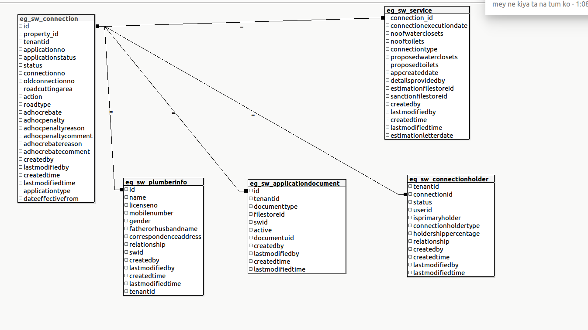

# Sewerage Service

## Overview

This is one of the major application of the egov stack which helps municipal and citizens to handle sewerage services like creating sewerage connection, searching sewerage connection, sewerage connection, also creating property if it doesn't exist and creating and updating workflow were depending on different roles of the logged-in user he/she can perform various actions like editing or perform document verification and many more specified in workflow documentation and SMS & email notification sent to the owner for various actions performed in the workflow.

## Pre-requisites

Before you proceed with the documentation, make sure the following pre-requisites are met -

* _Java 8_
* Kafka server is up and running
* egov-persister service is running and has sewerage service persister config path added in it
* PSQL server is running and a database is created to store sewerage connection / application data
* knowledge of eGov-mdms service, eGov-persister, eGov-idgen, eGov-sms, eGov-email,eGov-user, eGov-localization, eGov-workflow-service will be helpful.

## Key Functionalities

The sewerage service provides multiple functionalities starting from serving as a central repository where one can create sewerage connection, update sewerage connection, search for a particular sewerage connection based on different criteria like mobile number, sewerage connection nos etc. and also creating property if it doesn't exist, creating and updating workflow were depending on different roles of the logged-in user he/she can perform various actions like editing or perform document verification and many more specified in workflow documentation and SMS & email notification sent to the owner for various actions performed in the workflow. The different services provided by the sewerage services are

* Creating sewerage connection
* Updating sewerage connection
* Apply for Property creation.
* Searching sewerage connection based on **a** few criteria mentioned in swagger documentation later
* Creating property if it doesn't exist
* Creating and updating workflow.

|                                                              |                                                                                                                                  |
| ------------------------------------------------------------ | -------------------------------------------------------------------------------------------------------------------------------- |
| **Environment Variables**                                    | **Description**                                                                                                                  |
| egov.sewarageservice.createconnection                        | This variable contains the kafka topic name which is used to create new sewerage connection application in the system.           |
| egov.sewarageservice.updateconnection                        | This variable contains the kafka topic name which is used to update the existing v connection application in the system.         |
| egov.sewerageservice.updatesewerageconnection.workflow.topic | This variable contains the kafka topic name which is used to update the process instance of the sewerage connection application. |
| egov.idgen.scapid.name                                       | This variable contain the idgen format name for sewerage application                                                             |
| egov.idgen.scapid.format                                     | This variable contain the idgen format for sewerage application ex:- WS/\[CITY.CODE]/\[fy:yyyy-yy]/\[SEQ\_EGOV\_COMMON]          |
| egov.idgen.scid.name                                         | This variable contain the idgen format name for sewerage connection                                                              |
| egov.idgen.scid.format                                       | This variable contain the idgen format for sewerage connection ex:- WS\_AP/\[CITY.CODE]/\[fy:yyyy-yy]/\[SEQ\_EGOV\_COMMON]       |

### Interaction Diagram <a href="#interaction-diagram" id="interaction-diagram"></a>

To Do

_**Table UML Diagram**_



_\*\*\*\*_

### Configuration Details <a href="#configuration-details" id="configuration-details"></a>

_**MDMS configuration**_

[https://github.com/egovernments/egov-mdms-data/tree/DEV/data - Connect to preview](https://github.com/egovernments/egov-mdms-data/tree/DEV/data)\`\`

```
sw-services-calculation
PropertyTax
```

master-config.json for sewerage service

```
sw-services-calculation": {
    "Interest": {
      "masterName": "Interest",
      "isStateLevel": true,
      "uniqueKeys": [
        "$.fromFY"
      ]
    },
    "Rebate": {
      "masterName": "Rebate",
      "isStateLevel": true,
      "uniqueKeys": [
        "$.fromFY"
      ]
    },
    "Penalty": {
      "masterName": "Penalty",
      "isStateLevel": true,
      "uniqueKeys": [
        "$.fromFY"
      ]
    },
    "SCBillingSlab": {
      "masterName": "SCBillingSlab",
      "isStateLevel": true,
      "uniqueKeys": []
    },
    "billingPeriod": {
      "masterName": "billingPeriod",
      "isStateLevel": true,
      "uniqueKeys": [
        "$.billingCycle"
      ]
    },
    "SW_CHARGE": {
      "masterName": "SW_CHARGE",
      "isStateLevel": true,
      "uniqueKeys": []
    },
    "SW_TIME_PENALTY": {
      "masterName": "SW_TIME_PENALTY",
      "isStateLevel": true,
      "uniqueKeys": []
    },
    "SW_Round_Off": {
      "masterName": "SW_Round_Off",
      "isStateLevel": true,
      "uniqueKeys": []
    },
    "PlotSizeSlab": {
      "masterName": "PlotSizeSlab",
      "isStateLevel": true,
      "uniqueKeys": []
    },
    "PropertyUsageType": {
      "masterName": "PropertyUsageType",
      "isStateLevel": true,
      "uniqueKeys": []
    },
    "FeeSlab": {
      "masterName": "FeeSlab",
      "isStateLevel": true,
      "uniqueKeys": []
    },
    "RoadType": {
      "masterName": "RoadType",
      "isStateLevel": true,
      "uniqueKeys": []
    },
    "CalculationAttribute": {
      "masterName": "CalculationAttribute",
      "isStateLevel": true,
      "uniqueKeys": []
    }
  }
```

Property creation through WNS module\
[https://github.com/egovernments/egov-mdms-data/blob/DEV/data/pb/PropertyTax/PTWorkflow.json](https://github.com/egovernments/egov-mdms-data/blob/DEV/data/pb/PropertyTax/PTWorkflow.json)

_**Persister configuration**_**:**\
[https://github.com/egovernments/configs/blob/qa/egov-persister/sewerage-persist.yml](https://github.com/egovernments/configs/blob/qa/egov-persister/sewerage-persist.yml)

**Actions & Role Action Mapping**

**Actions**

```
[
  {
      "id": {{PLACEHOLDER1}},
      "name": "Create Sewerage Connection",
      "url": "/sw-services/swc/_create",
      "displayName": "Create Sewerage Connection",
      "orderNumber": 0,
      "enabled": false,
      "serviceCode": "sw-services",
      "code": "null",
      "path": ""
    },
    {
      "id": {{PLACEHOLDER2}},
      "name": "Update Sewerage Connection",
      "url": "/sw-services/swc/_update",
      "displayName": "Update Sewerage Connection",
      "orderNumber": 0,
      "enabled": false,
      "serviceCode": "sw-services",
      "code": "null",
      "path": ""
    },
    {
      "id": {{PLACEHOLDER3}},
      "name": "Search Sewerage Connection",
      "url": "/sw-services/swc/_search",
      "displayName": "Search Sewerage Connection",
      "orderNumber": 0,
      "enabled": false,
      "serviceCode": "sw-services",
      "code": "null",
      "path": ""
    }
]
```

**Role Action Mapping**

```
[
  {
      "rolecode": "CITIZEN",
      "actionid": {{PLACEHOLDER1}},
      "actioncode": "",
      "tenantId": "pb"
    },
    {
      "rolecode": "CITIZEN",
      "actionid": {{PLACEHOLDER2}},
      "actioncode": "",
      "tenantId": "pb"
    },
    {
      "rolecode": "CITIZEN",
      "actionid": {{PLACEHOLDER3}},
      "actioncode": "",
      "tenantId": "pb"
    },
    {
      "rolecode": "SW_CEMP",
      "actionid": {{PLACEHOLDER1}},
      "actioncode": "",
      "tenantId": "pb"
    },
    {
      "rolecode": "SW_CEMP",
      "actionid": {{PLACEHOLDER2}},
      "actioncode": "",
      "tenantId": "pb"
    },
    {
      "rolecode": "SW_CEMP",
      "actionid": {{PLACEHOLDER3}},
      "actioncode": "",
      "tenantId": "pb"
    },
    {
      "rolecode": "SW_DOC_VERIFIER",
      "actionid": {{PLACEHOLDER2}},
      "actioncode": "",
      "tenantId": "pb"
    },
    {
      "rolecode": "SW_DOC_VERIFIER",
      "actionid": {{PLACEHOLDER3}},
      "actioncode": "",
      "tenantId": "pb"
    },
    {
      "rolecode": "SW_FIELD_INSPECTOR",
      "actionid": {{PLACEHOLDER2}},
      "actioncode": "",
      "tenantId": "pb"
    },
    {
      "rolecode": "SW_FIELD_INSPECTOR",
      "actionid": {{PLACEHOLDER3}},
      "actioncode": "",
      "tenantId": "pb"
    },
    {
      "rolecode": "SW_APPROVER",
      "actionid": {{PLACEHOLDER2}},
      "actioncode": "",
      "tenantId": "pb"
    },
    {
      "rolecode": "SW_APPROVER",
      "actionid": {{PLACEHOLDER3}},
      "actioncode": "",
      "tenantId": "pb"
    },
    {
      "rolecode": "SW_CLERK",
      "actionid": {{PLACEHOLDER2}},
      "actioncode": "",
      "tenantId": "pb"
    },
    {
      "rolecode": "SW_CLERK",
      "actionid": {{PLACEHOLDER3}},
      "actioncode": "",
      "tenantId": "pb"
    }
]

```

_**Workflow business service config**_

Create businessService (workflow configuration) using the \_\_/businessservice/\_create. Following is the product configuration for sewerage service

```
{
  "RequestInfo": {
    "apiId": "Rainmaker",
    "action": "",
    "did": 1,
    "key": "",
    "msgId": "20170310130900|en_IN",
    "requesterId": "",
    "ts": 1513579888683,
    "ver": ".01",
    "authToken": "{{Auth_Token}}"
  },
  "BusinessServices": [
    {
      "tenantId": "pb",
      "businessService": "NewSW1",
      "business": "sw-services",
      "businessServiceSla": 259200000,
      "states": [
        {
          "sla": null,
          "state": null,
          "applicationStatus": null,
          "docUploadRequired": false,
          "isStartState": true,
          "isTerminateState": false,
          "isStateUpdatable": false,
          "actions": [
            {
              "action": "INITIATE",
              "nextState": "INITIATED",
              "roles": [
                "CITIZEN",
                "SW_CEMP"
              ]
            }
          ]
        },
        {
          "sla": null,
          "state": "INITIATED",
          "applicationStatus": "INITIATED",
          "docUploadRequired": false,
          "isStartState": false,
          "isTerminateState": false,
          "isStateUpdatable": true,
          "actions": [
            {
              "action": "SUBMIT_APPLICATION",
              "nextState": "PENDING_FOR_DOCUMENT_VERIFICATION",
              "roles": [
                "CITIZEN",
                "SW_CEMP"
              ]
            }
          ]
        },
        {
          "sla": null,
          "state": "PENDING_FOR_CITIZEN_ACTION",
          "applicationStatus": "PENDING_FOR_CITIZEN_ACTION",
          "docUploadRequired": false,
          "isStartState": false,
          "isTerminateState": false,
          "isStateUpdatable": true,
          "actions": [
            {
              "action": "RESUBMIT_APPLICATION",
              "nextState": "PENDING_FOR_DOCUMENT_VERIFICATION",
              "roles": [
                "CITIZEN",
                "SW_CEMP"
              ]
            }
          ]
        },
        {
          "sla": null,
          "state": "PENDING_FOR_DOCUMENT_VERIFICATION",
          "applicationStatus": "PENDING_FOR_DOCUMENT_VERIFICATION",
          "docUploadRequired": false,
          "isStartState": false,
          "isTerminateState": false,
          "isStateUpdatable": true,
          "actions": [
            {
              "action": "VERIFY_AND_FORWARD",
              "nextState": "PENDING_FOR_FIELD_INSPECTION",
              "roles": [
                "SW_DOC_VERIFIER"
              ]
            },
            {
              "action": "REJECT",
              "nextState": "REJECTED",
              "roles": [
                "SW_DOC_VERIFIER"
              ]
            },
            {
              "action": "SEND_BACK_TO_CITIZEN",
              "nextState": "PENDING_FOR_CITIZEN_ACTION",
              "roles": [
                "SW_DOC_VERIFIER"
              ]
            }
          ]
        },
        {
          "sla": null,
          "state": "REJECTED",
          "applicationStatus": "REJECTED",
          "isStateUpdatable": false,
          "docUploadRequired": false,
          "isStartState": false,
          "isTerminateState": true
        },
        {
          "sla": 86400000,
          "state": "PENDING_FOR_FIELD_INSPECTION",
          "applicationStatus": "PENDING_FOR_FIELD_INSPECTION",
          "docUploadRequired": false,
          "isStartState": false,
          "isStateUpdatable": true,
          "isTerminateState": false,
          "actions": [
            {
              "action": "VERIFY_AND_FORWARD",
              "nextState": "PENDING_APPROVAL_FOR_CONNECTION",
              "roles": [
                "SW_FIELD_INSPECTOR"
              ]
            },
            {
              "action": "REJECT",
              "nextState": "REJECTED",
              "roles": [
                "SW_FIELD_INSPECTOR"
              ]
            },
            {
              "action": "SEND_BACK_FOR_DOCUMENT_VERIFICATION",
              "nextState": "PENDING_FOR_DOCUMENT_VERIFICATION",
              "roles": [
                "SW_FIELD_INSPECTOR"
              ]
            }
          ]
        },
        {
          "sla": 43200000,
          "state": "PENDING_APPROVAL_FOR_CONNECTION",
          "applicationStatus": "PENDING_APPROVAL_FOR_CONNECTION",
          "docUploadRequired": false,
          "isStartState": false,
          "isStateUpdatable": true,
          "isTerminateState": false,
          "actions": [
            {
              "action": "APPROVE_FOR_CONNECTION",
              "nextState": "PENDING_FOR_PAYMENT",
              "roles": [
                "SW_APPROVER"
              ]
            },
            {
              "action": "REJECT",
              "nextState": "REJECTED",
              "roles": [
                "SW_APPROVER"
              ]
            },
            {
              "action": "SEND_BACK_FOR_FIELD_INSPECTION",
              "nextState": "PENDING_FOR_FIELD_INSPECTION",
              "roles": [
                "SW_APPROVER"
              ]
            }
          ]
        },
        {
          "sla": 43200000,
          "state": "PENDING_FOR_PAYMENT",
          "applicationStatus": "PENDING_FOR_PAYMENT",
          "docUploadRequired": false,
          "isStartState": false,
          "isTerminateState": false,
          "isStateUpdatable": false,
          "actions": [
            {
              "action": "PAY",
              "nextState": "PENDING_FOR_CONNECTION_ACTIVATION",
              "roles": [
                "CITIZEN",
                "SW_CEMP"
              ]
            }
          ]
        },
        {
          "sla": null,
          "state": "PENDING_FOR_CONNECTION_ACTIVATION",
          "applicationStatus": "PENDING_FOR_CONNECTION_ACTIVATION",
          "isStateUpdatable": true,
          "docUploadRequired": false,
          "isStartState": false,
          "isTerminateState": false,
          "actions": [
            {
              "action": "ACTIVATE_CONNECTION",
              "nextState": "CONNECTION_ACTIVATED",
              "roles": [
                "SW_CLERK"
              ]
            }
          ]
        },
        {
          "sla": null,
          "state": "CONNECTION_ACTIVATED",
          "applicationStatus": "CONNECTION_ACTIVATED",
          "isStateUpdatable": false,
          "docUploadRequired": false,
          "isStartState": false,
          "isTerminateState": true
        }
      ]
    }
  ]
}
```

Workflow for property creation through Water and Sewerage Module

```
{
    "BusinessServices": [
    {
      "tenantId": "pb",
      "businessService": "PT.CREATEWITHWNS",
      "business": "PT",
      "businessServiceSla": null,
      "states": [
        {
          "sla": null,
          "state": null,
          "applicationStatus": "INWORKFLOW",
          "docUploadRequired": false,
          "isStartState": true,
          "isTerminateState": false,
          "isStateUpdatable": false,
          "actions": [
            {
              "action": "OPEN",
              "nextState": "INITIATED",
              "roles": [
                "CITIZEN",
                "WS_CEMP",
                "SW_CEMP"
              ]
            }
          ]
        },
        {
          "sla": null,
          "state": "INITIATED",
          "applicationStatus": "INWORKFLOW",
          "docUploadRequired": false,
          "isStartState": true,
          "isTerminateState": false,
          "isStateUpdatable": true,
          "actions": [
            {
              "action": "SUBMIT",
              "nextState": "APPROVED",
              "roles": [
                "EMPLOYEE",
                "CITIZEN",
                "SW_CEMP",
                "WS_CEMP"
              ]
            },
            {
              "action": "BACK",
              "nextState": "INWORKFLOW",
              "roles": [
                "EMPLOYEE",
                "CITIZEN",
                "SW_CEMP",
                "WS_CEMP"
              ]
            }
          ]
        },
        {
          "sla": null,
          "state": "INWORKFLOW",
          "applicationStatus": "INWORKFLOW",
          "docUploadRequired": false,
          "isStartState": true,
          "isTerminateState": false,
          "isStateUpdatable": true,
          "actions": [
            {
              "action": "SUBMIT",
              "nextState": "APPROVED",
              "roles": [
                "EMPLOYEE",
                "CITIZEN",
                "SW_CEMP",
                "WS_CEMP"
              ]
            }
          ]
        },
        {
          "sla": null,
          "state": "APPROVED",
          "applicationStatus": "ACTIVE",
          "docUploadRequired": false,
          "isStartState": false,
          "isTerminateState": true,
          "isStateUpdatable": false,
          "actions": null
        }
      ]
    }
  ]
}
```

_**Indexer config for sewerage-service**_

* The indexer provides the facility for indexing the data to elastic search. [https://github.com/egovernments/configs/blob/DEV/egov-indexer/sewerage-service.yml](https://github.com/egovernments/configs/blob/DEV/egov-indexer/sewerage-service.yml)

**Setup**

1. Write the configuration for sewerage service. [https://github.com/egovernments/configs/blob/DEV/egov-indexer/sewerage-service.yml](https://github.com/egovernments/configs/blob/DEV/egov-indexer/sewerage-service.yml)
2. Provide the absolute path of the checked-in file to DevOps, to add it to the file-read path of egov-indexer. The file will be added to the egov-indexer's environment manifest file for it to be read at the start-up of the application.
3. Put indexer config file to the config repo under egov-indexer folder. ([egovernments/configs](https://github.com/egovernments/configs) )
4. Run the egov-indexer app, Since it is a consumer, it starts listening to the configured topics and indexes the data.

_**Modify connection**_

After connection activation or legacy connection, we can edit the connection. This process based on a defined workflow. Any action is based on defined roles on the action level. For edit connection, we need to upload some supporting documents and mandatory info.

**Workflow config for edit connection**

Create businessService (workflow configuration) using the \_\_/businessservice/\_create. Following is the product configuration for editing sewerage connection.

```
{
  "RequestInfo": {
    "apiId": "Rainmaker",
    "action": "",
    "did": 1,
    "key": "",
    "msgId": "20170310130900|en_IN",
    "requesterId": "",
    "ts": 1513579888683,
    "ver": ".01",
    "authToken": "{{Auth_Token}}"
  },
  "BusinessServices": [
    {
      "tenantId": "pb",
      "businessService": "ModifySWConnection",
      "business": "sw-services",
      "businessServiceSla": 259200000,
      "states": [
        {
          "sla": null,
          "state": null,
          "applicationStatus": null,
          "docUploadRequired": false,
          "isStartState": true,
          "isTerminateState": false,
          "isStateUpdatable": false,
          "actions": [
            {
              "action": "INITIATE",
              "nextState": "INITIATED",
              "roles": [
                "SW_CEMP"
              ]
            }
          ]
        },
        {
          "sla": null,
          "state": "INITIATED",
          "applicationStatus": "INITIATED",
          "docUploadRequired": false,
          "isStartState": false,
          "isTerminateState": false,
          "isStateUpdatable": true,
          "actions": [
            {
              "action": "SUBMIT_APPLICATION",
              "nextState": "PENDING_FOR_APPROVAL",
              "roles": [
                "SW_CEMP"
              ]
            }
          ]
        },
        {
          "sla": 86400000,
          "state": "PENDING_FOR_APPROVAL",
          "applicationStatus": "PENDING_FOR_APPROVAL",
          "docUploadRequired": false,
          "isStartState": false,
          "isStateUpdatable": true,
          "isTerminateState": false,
          "actions": [
            {
              "action": "APPROVE_CONNECTION",
              "nextState": "APPROVED",
              "roles": [
                "SW_APPROVER"
              ]
            },
            {
              "action": "REJECT",
              "nextState": "REJECTED",
              "roles": [
                "SW_APPROVER"
              ]
            },
            {
              "action": "SEND_BACK",
              "nextState": "INITIATED",
              "roles": [
                "SW_APPROVER"
              ]
            }
          ]
        },
        {
          "sla": null,
          "state": "REJECTED",
          "applicationStatus": "REJECTED",
          "isStateUpdatable": false,
          "docUploadRequired": false,
          "isStartState": false,
          "isTerminateState": true
        },
        {
          "sla": null,
          "state": "APPROVED",
          "applicationStatus": "APPROVED",
          "isStateUpdatable": false,
          "docUploadRequired": false,
          "isStartState": false,
          "isTerminateState": true
        }
      ]
    }
  ]
}
```

`1{ 2 "RequestInfo": { 3 "apiId": "Rainmaker", 4 "action": "", 5 "did": 1, 6 "key": "", 7 "msgId": "20170310130900|en_IN", 8 "requesterId": "", 9 "ts": 1513579888683, 10 "ver": ".01", 11 "authToken": "{{Auth_Token}}" 12 }, 13 "BusinessServices": [ 14 { 15 "tenantId": "pb", 16 "businessService": "ModifySWConnection", 17 "business": "sw-services", 18 "businessServiceSla": 259200000, 19 "states": [ 20 { 21 "sla": null, 22 "state": null, 23 "applicationStatus": null, 24 "docUploadRequired": false, 25 "isStartState": true, 26 "isTerminateState": false, 27 "isStateUpdatable": false, 28 "actions": [ 29 { 30 "action": "INITIATE", 31 "nextState": "INITIATED", 32 "roles": [ 33 "SW_CEMP" 34 ] 35 } 36 ] 37 }, 38 { 39 "sla": null, 40 "state": "INITIATED", 41 "applicationStatus": "INITIATED", 42 "docUploadRequired": false, 43 "isStartState": false, 44 "isTerminateState": false, 45 "isStateUpdatable": true, 46 "actions": [ 47 { 48 "action": "SUBMIT_APPLICATION", 49 "nextState": "PENDING_FOR_APPROVAL", 50 "roles": [ 51 "SW_CEMP" 52 ] 53 } 54 ] 55 }, 56 { 57 "sla": 86400000, 58 "state": "PENDING_FOR_APPROVAL", 59 "applicationStatus": "PENDING_FOR_APPROVAL", 60 "docUploadRequired": false, 61 "isStartState": false, 62 "isStateUpdatable": true, 63 "isTerminateState": false, 64 "actions": [ 65 { 66 "action": "APPROVE_CONNECTION", 67 "nextState": "APPROVED", 68 "roles": [ 69 "SW_APPROVER" 70 ] 71 }, 72 { 73 "action": "REJECT", 74 "nextState": "REJECTED", 75 "roles": [ 76 "SW_APPROVER" 77 ] 78 }, 79 { 80 "action": "SEND_BACK", 81 "nextState": "INITIATED", 82 "roles": [ 83 "SW_APPROVER" 84 ] 85 } 86 ] 87 }, 88 { 89 "sla": null, 90 "state": "REJECTED", 91 "applicationStatus": "REJECTED", 92 "isStateUpdatable": false, 93 "docUploadRequired": false, 94 "isStartState": false, 95 "isTerminateState": true 96 }, 97 { 98 "sla": null, 99 "state": "APPROVED", 100 "applicationStatus": "APPROVED", 101 "isStateUpdatable": false, 102 "docUploadRequired": false, 103 "isStartState": false, 104 "isTerminateState": true 105 } 106 ] 107 } 108 ] 109} 110`

**Notification**

Notification will be sent to the property owners and connection holders based on different application states.

**Capturing connection holders**

We can add connection holders to the sewerage connection which will be the owner of the connection. We can fill in the connection holders' details or we can just make the property owner to the connection holder.

The connection holder will get a notification based on a different state of the application. We are pushing the data of the connection holders in the user service too.

**Multiple Road Type Support**\
We can add road cutting details of multiple roads to the sewerage connection. For each road which goes under cutting process we have to fill their road type details and road cutting area.\
Based on this information, application one time fee estimate is calculated.

## Integration

### Integration Scope

This sw-service module is use to manage sewerage service connections against a property in the system.

### Integration Benefits

* Provide backend support for the different sewerage connection registration process.
* Mseva and SMS notifications on application status changes.
* Elastic search index for creating visualisations and Dashboards.
* Supports workflow which is configurable

### Steps to Integration

1. To integrate, the host of sw-service module should be overwritten in helm chart.
2. /sw-services/swc/\_create should be added as the create endpoint for creating sewerage application/connection in the system
3. /sw-services/swc/\_search should be added as the search endpoint .This method handles all requests to search existing records depending on different search criteria
4. /sw-services/swc/\_update should be added as the update endpoint. This method is used to update fields in existing records or to update the status of the application based on workflow.

## Reference Docs

#### Doc Links <a href="#doc-links" id="doc-links"></a>

|                             |                                                                                                                                                                       |
| --------------------------- | --------------------------------------------------------------------------------------------------------------------------------------------------------------------- |
| **Title**                   | **Link**                                                                                                                                                              |
| API Swagger Documentation   | [Swagger Documentation](https://editor.swagger.io/?url=https://raw.githubusercontent.com/egovernments/municipal-services/master/docs/water-sewerage-services.yaml#!/) |
| Sewerage Calculator Service | [Sewerage Calculator Service](https://digit-discuss.atlassian.net/l/c/vGpEzt2Q)                                                                                       |

#### API List <a href="#api-list" id="api-list"></a>

|                             |                                                                                                                            |
| --------------------------- | -------------------------------------------------------------------------------------------------------------------------- |
| Title                       | **Link**                                                                                                                   |
| _/sw-services/swc/\_create_ | [https://www.getpostman.com/collections/c160dd65f1d585ed855f](https://www.getpostman.com/collections/c160dd65f1d585ed855f) |
| _/sw-services/swc/\_update_ | [https://www.getpostman.com/collections/c160dd65f1d585ed855f](https://www.getpostman.com/collections/c160dd65f1d585ed855f) |
| _/sw-services/swc/\_search_ | [https://www.getpostman.com/collections/c160dd65f1d585ed855f](https://www.getpostman.com/collections/c160dd65f1d585ed855f) |

_(Note: All the API’s are in the same postman collection therefore same link is added in each row)_

\_\_

\_\_

> [\_\_](http://creativecommons.org/licenses/by/4.0/)_All content on this page by_ [_eGov Foundation_ ](https://egov.org.in/)_is licensed under a_ [_Creative Commons Attribution 4.0 International License_](http://creativecommons.org/licenses/by/4.0/)_._
