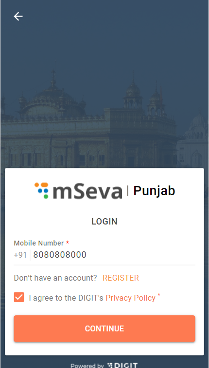

# Consent Form Citizen User Manual

Citizens represent individuals, communities, or business entities who are the system end-users.\
This feature is to get consent from the citizen during the citizen login. This is needed only on the citizen/architect side of the login.

A citizen has to click on the checkbox to agree to DIGIT’s privacy policy**.**

The citizen consent form is available on -

* [Old UI](consent-form-citizen-user-manual.md#old-ui)
* [New UI](consent-form-citizen-user-manual.md#new-ui)
* [Payment page without login](consent-form-citizen-user-manual.md#payment-page-without-login)

## **Old UI**

Enter your registered mobile number.

Click on the **I agree to the DIGIT's Privacy Policy check box** to give consent.

.png>)

Click on the **Privacy Policy** hyperlink to view the privacy terms.

Check the **I agree to the DIGIT's Privacy Policy check box** and click on the **Next** button to log in.\

## **New UI**

Enter your registered mobile number.

Check the **I agree to the DIGIT's Privacy Policy check box** and click on the **Next** button to log in.

Click on the **Privacy Policy** hyperlink to view the privacy terms.

Check the **I agree to the DIGIT's Privacy Policy check box** and click on the **Next** button to log in.

## **Payment Page Without Login**

Open the DIGIT landing page.

Click on the **Property Tax** card.

.png>)

Click on the **Search and Pay** option**.**

.png>)

Enter the required parameters and click on **Search**.

.png>)

The landing page displays all the bills along with **Totals Dues.**

Click on the **View Details** button.

.png>)

Click on **Proceed To Pay.**

.png>)

This opens the **payer’s Details** page.

.png>)

Check the **I agree to the DIGIT's Privacy Policy** to agree and proceed with the payment.

.png>)

Click on the **Privacy Policy** hyperlink to view the privacy terms.

.png>)

Click on the **Next** button and continue with the payment process.

.png>)\
