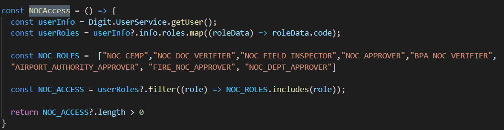

# NOC Inbox

## Overview

Users can view all the applications assigned to them in the employee inbox. And it provides multiple filters and search options to filter the applications.

NOC Inbox uses InboxComposer React HOC to create the Inbox through various child components, for both mobile and desktop components.

.png>)

## API Details

The API used to fetch applications in the inbox

```
curl 'https://qa.digit.org/inbox/v1/_search?_=1639397081025' \
  -H 'Connection: keep-alive' \
  -H 'sec-ch-ua: " Not A;Brand";v="99", "Chromium";v="96", "Google Chrome";v="96"' \
  -H 'Accept: application/json, text/plain, */*' \
  -H 'DNT: 1' \
  -H 'Content-Type: application/json;charset=UTF-8' \
  -H 'sec-ch-ua-mobile: ?0' \
  -H 'User-Agent: Mozilla/5.0 (Windows NT 10.0; Win64; x64) AppleWebKit/537.36 (KHTML, like Gecko) Chrome/96.0.4664.93 Safari/537.36' \
  -H 'sec-ch-ua-platform: "Windows"' \
  -H 'Origin: https://qa.digit.org' \
  -H 'Sec-Fetch-Site: same-origin' \
  -H 'Sec-Fetch-Mode: cors' \
  -H 'Sec-Fetch-Dest: empty' \
  -H 'Referer: https://qa.digit.org/digit-ui/employee' \
  -H 'Accept-Language: en-US,en;q=0.9,hi;q=0.8' \
  --data-raw '{"inbox":{"tenantId":"pb.amritsar","processSearchCriteria":{"moduleName":"noc-services","businessService":["FIRE_NOC_SRV","FIRE_NOC_OFFLINE","AIRPORT_NOC_OFFLINE","AIRPORT_NOC_SRV"]},"moduleSearchCriteria":{"assignee":"ASSIGNED_TO_ALL","sortOrder":"DESC"},"sortBy":"","limit":10,"offset":0,"sortOrder":"DESC"},"RequestInfo":{"apiId":"Rainmaker","authToken":"b5e49647-04b9-4a1c-992a-d8941adfe910","userInfo":{"id":12588,"uuid":"a56bae11-e18b-4dd3-b70f-b29f2abb1edf","userName":"EMP-BPA","name":"SR DV FI","mobileNumber":"9999999445","emailId":null,"locale":null,"type":"EMPLOYEE","roles":[{"name":"BPAREG doc verifier","code":"BPAREG_DOC_VERIFIER","tenantId":"pb"},{"name":"Employee","code":"EMPLOYEE","tenantId":"pb.amritsar"},{"name":"BPAREG Employee","code":"BPAREG_EMPLOYEE","tenantId":"pb.amritsar"},{"name":"BPAREG Approver","code":"BPAREG_APPROVER","tenantId":"pb"},{"name":"BPA Services verifier","code":"BPA_VERIFIER","tenantId":"pb.amritsar"},{"name":"QA Automation","code":"QA_AUTOMATION","tenantId":"pb.amritsar"},{"name":"State Administrator","code":"STADMIN","tenantId":"pb.amritsar"},{"name":"Super User","code":"SUPERUSER","tenantId":"pb.amritsar"},{"name":"BPAREG Approver","code":"BPAREG_APPROVER","tenantId":"pb.amritsar"},{"name":"Employee","code":"EMPLOYEE","tenantId":"pb"},{"name":"BPAREG doc verifier","code":"BPAREG_DOC_VERIFIER","tenantId":"pb.amritsar"},{"name":"BPA NOC Verifier","code":"BPA_NOC_VERIFIER","tenantId":"pb.amritsar"}],"active":true,"tenantId":"pb.amritsar","permanentCity":null}}}' \
  --compressed
```

**NOCAccess function to view NOC Inbox**



Use the MDMS (available as blue hyperlinks) for selecting OBPS [application type](https://github.com/egovernments/egov-mdms-data/blob/DEV/data/pb/BPA/ApplicationType.json), [service type](https://github.com/egovernments/egov-mdms-data/blob/DEV/data/pb/BPA/ServiceType.json), risk type with business service and status filter.

**Config for risk type definition**

```
  const availableBusinessServices = [{
      code: "FIRE_NOC_SRV",
      i18nKey: "WF_FIRE_NOC_FIRE_NOC_SRV"
    },{
      code: "FIRE_NOC_OFFLINE",
      i18nKey: "WF_FIRE_NOC_FIRE_NOC_OFFLINE"
    },{
      code: "AIRPORT_NOC_OFFLINE",
      i18nKey: "WF_FIRE_NOC_AIRPORT_NOC_OFFLINE"
    },{
      code: "AIRPORT_NOC_SRV",
      i18nKey: "WF_FIRE_NOC_AIRPORT_NOC_SRV"
  }]
```


> [\_\_](http://creativecommons.org/licenses/by/4.0/)_All content on this page by_ [_eGov Foundation_ ](https://egov.org.in/)_is licensed under a_ [_Creative Commons Attribution 4.0 International License_](http://creativecommons.org/licenses/by/4.0/)_._
