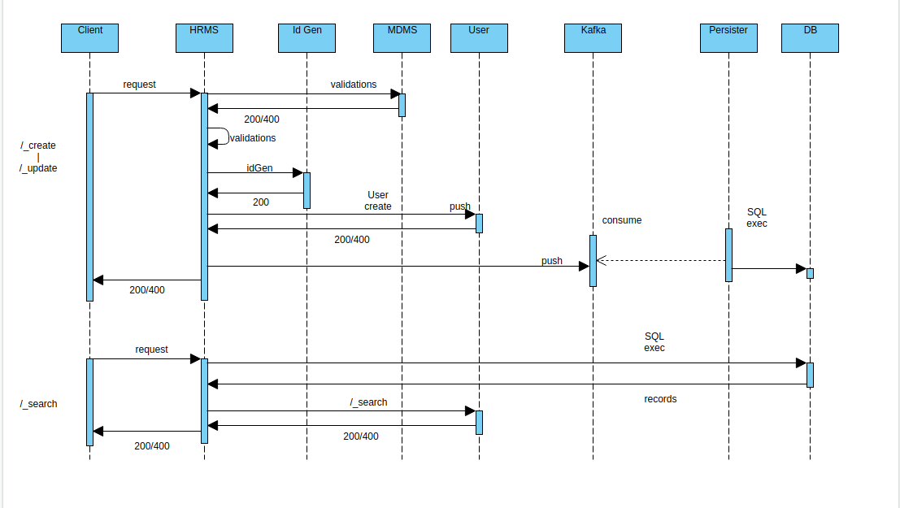

# HRMS Service

## Overview <a href="#overview" id="overview"></a>

The objective of HRMS is to provide a service that manages all the employees enrolled in the system. HRMS provides extensive APIs to create, update and search the employees with attributes like assignments, service history, jurisdiction, etc. HRMS can be treated as a sub-set of the egov-user service. Every employee created through HRMS is added as a user in the egov-user.&#x20;

## Pre-requisites <a href="#pre-requisites" id="pre-requisites"></a>

Before you proceed with the documentation, make sure the following pre-requisites are met -

* _Java 8_
* Kafka server is up and running
* egov-persister service is running and has the HRMS service persister config path added to it
* PSQL server is running and a database is created to store employee data.

## Key Functionalities <a href="#key-functionalities" id="key-functionalities"></a>

* This service provides a feature to create, update and search the employee in the system.
* It provides a feature to add various roles to an employee under multiple jurisdictions.
* It provides a feature to deactivate and reactivate an employee.
* It records the employee details like assignment details, jurisdiction details, and personal details.

Following are the properties in the application.properties file in HRMS service which is configurable.

| **Property**                                      | **Value**                                                                                      | **Remarks**                                                                                                                                            |
| ------------------------------------------------- | ---------------------------------------------------------------------------------------------- | ------------------------------------------------------------------------------------------------------------------------------------------------------ |
| <p>egov.hrms.employee.app.link</p><p> </p>        | [https://dev.digit.org/employee/user/login](https://mseva.lgpunjab.gov.in/employee/user/login) | This is the link to the mseva app, which differs based on the environment.                                                                             |
| <p>egov.hrms.default.pagination.limit</p><p> </p> | 200                                                                                            | This is the pagination limit on search results of employee search, it can be set to any numeric value without decimals.                                |
| <p>egov.hrms.default.pwd.length</p><p> </p>       | 10                                                                                             | This is the length of password to be generated at the time of employee creation. However, please ensure this is in sync with the egov-user pwd policy. |
| <p>open.search.enabled.roles</p><p> </p>          | <p>SUPERUSER,ADMIN</p><p> </p>                                                                 | This is a list of Role codes that are allowed to perform an open-search in hrms.                                                                       |
| kafka.topics.notification.sms                     | egov.core.notification.sms                                                                     | Kafka Topic to push the sms request. Please ensure this is in sync with egov-notification-sms service.                                                 |
| <p>kafka.topics.save.service</p><p> </p>          | save-hrms-employee                                                                             | Kafka topic to push the save request in hrms. Please ensure this in sync with the persister.                                                           |
| <p>kafka.topics.update.service</p><p> </p>        | update-hrms-employee                                                                           | Kafka topic to push the update request in hrms. Please ensure this in sync with the persister.                                                         |
| <p>egov.idgen.ack.name</p><p> </p>                | <p>hrms.employeecode</p><p> </p>                                                               | Key to be configured in Idgen alongwith the ID format to generate employee code.                                                                       |
| egov.idgen.ack.format                             | <p>EMP-[city]-[SEQ_EG_HRMS_EMP_CODE]</p><p> </p>                                               | Format to be configured in ID gen to generate employee code.                                                                                           |

## Interaction Diagram



## Configuration Details <a href="#configuration-details" id="configuration-details"></a>

Following is the list of masters required for HRMS:&#x20;

#### common-masters:  <a href="#common-masters" id="common-masters"></a>

* Department&#x20;

```
{
  "tenantId": "state",
  "moduleName": "common-masters",
  "Department": [
    {
      "name": "Street Lights",
      "code": "DEPT_1",
      "active": true
    },
    {
      "name": "Building & Roads",
      "code": "DEPT_2",
      "active": true
    },
    {
      "name": "Health & Sanitation",
      "code": "DEPT_3",
      "active": true
    },
    {
      "name": "Operation & Maintenance",
      "code": "DEPT_4",
      "active": true
    },
    {
      "name": "Horticulture",
      "code": "DEPT_5",
      "active": true
    },
    {
      "name": "Building Branch",
      "code": "DEPT_6",
      "active": true
    },
    {
      "name": "Citizen service desk",
      "code": "DEPT_7",
      "active": true
    },
    {
      "name": "Complaint Cell",
      "code": "DEPT_8",
      "active": true
    },
    {
      "name": "Executive Branch",
      "code": "DEPT_9",
      "active": true
    },
    {
      "name": "Others",
      "code": "DEPT_10",
      "active": true
    },
    {
      "name": "Tax Branch",
      "code": "DEPT_13",
      "active": true
    },
    {
      "name": "Accounts Branch",
      "code": "DEPT_25",
      "active": true
    },
    {
      "name": "Works Branch",
      "code": "DEPT_35",
      "active": true
    }
  ]
}
```

* Designation -

```
{
  "tenantId": "state",
  "moduleName": "common-masters",
  "Designation": [
    {
      "code": "DESIG_01",
      "name": "Superintending Engineer ( B&R)",
      "description": "Superintending Engineer ( B&R)",
      "active": true
    },
    {
      "code": "DESIG_02",
      "name": "Corporation Engineer (B&R)",
      "description": "Corporation Engineer (B&R)",
      "active": true
    },
    {
      "code": "DESIG_03",
      "name": "Asst. Engineer ( B&R)",
      "description": "Asst. Engineer ( B&R)",
      "active": true
    },
    {
      "code": "DESIG_04",
      "name": "Junior Engineer ( B&R)",
      "description": "Junior Engineer ( B&R)",
      "active": true
    },
    {
      "code": "DESIG_05",
      "name": "Land Scape Officer",
      "description": "Land Scape Officer",
      "active": true
    },
    {
      "code": "DESIG_06",
      "name": "Superintending Engineer ( O&M)",
      "description": "Superintending Engineer ( O&M)",
      "active": true
    },
    {
      "code": "DESIG_07",
      "name": "Corporation Engineer (O&M)",
      "description": "Corporation Engineer (O&M)",
      "active": true
    },
    {
      "code": "DESIG_08",
      "name": "Asst. Engineer ( O&M)",
      "description": "Asst. Engineer ( O&M)",
      "active": true
    },
    {
      "code": "DESIG_09",
      "name": "Junior Engineer ( O&M)",
      "description": "Junior Engineer ( O&M)",
      "active": true
    },
    {
      "code": "DESIG_10",
      "name": "Superintending Engineer ( Light)",
      "description": "Superintending Engineer ( Light)",
      "active": true
    },
    {
      "code": "DESIG_11",
      "name": "Corporation Engineer (Light)",
      "description": "Corporation Engineer (Light)",
      "active": true
    },
    {
      "code": "DESIG_12",
      "name": "Junior Engineer ( Light)",
      "description": "Junior Engineer ( Light)",
      "active": true
    },
    {
      "code": "DESIG_13",
      "name": "Health Officer",
      "description": "Health Officer",
      "active": true
    },
    {
      "code": "DESIG_14",
      "name": "Medical Officer",
      "description": "Medical Officer",
      "active": true
    },
    {
      "code": "DESIG_15",
      "name": "Chief Sanitary Inspector",
      "description": "Mechanical Oversear",
      "active": true
    },
    {
      "code": "DESIG_16",
      "name": "Sainitary Inspector",
      "description": "Clerk",
      "active": true
    },
    {
      "code": "DESIG_17",
      "name": "Sainitary Supervisor",
      "description": "Accountant",
      "active": true
    },
    {
      "code": "DESIG_18",
      "name": "Senior Town Planner",
      "description": "Senior Town Planner",
      "active": true
    },
    {
      "code": "DESIG_19",
      "name": "Municipal Town Planner",
      "description": "Municipal Town Planner",
      "active": true
    },
    {
      "code": "DESIG_20",
      "name": "Asst. Town Planner",
      "description": "Asst. Town Planner",
      "active": true
    },
    {
      "code": "DESIG_21",
      "name": "Building Inspector",
      "description": "Building Inspector",
      "active": true
    },
    {
      "code": "DESIG_22",
      "name": "Junior Enginer ( Horticulutre)",
      "description": "Junior Enginer ( Horticulutre)",
      "active": true
    },
    {
      "code": "DESIG_23",
      "name": "Citizen service representative",
      "description": "Citizen service representative",
      "active": true
    },
    {
      "name": "Deputy Controller Finance and Accounts",
      "description": "Deputy Controller Finance and Accounts",
      "code": "DESIG_1001",
      "active": true
    },
   {
      "name": "Accountant",
      "description": "Accountant",
      "code": "DESIG_58",
      "active": true
    },
   {
      "code": "DESIG_24",
      "name": "Assistant Commissioner",
      "description": "Assistant Commissioner",
      "active": true
    },    
    {
      "name": "Superintendent",
      "description": "Superintendent",
      "code": "DESIG_47",
      "active": true
    }
  ]
}
```

#### _egov-hrms masters:_ <a href="#egov-hrms-masters" id="egov-hrms-masters"></a>

* Degree -

```
{
  "tenantId": "state",
  "moduleName": "egov-hrms",
  "Degree": [
    {
      "code": "MATRICULATION",
      "active": true
    },
    {
      "code": "10+2/EQUIVALENTDIPLOMA",
      "active": true
    },
    {
      "code": "B.A/B.SC./B.COM/BBA",
      "active": true
    },
    {
      "code": "LLB/LLM",
      "active": true
    },
    {
      "code": "B.E/B.TECH.",
      "active": true
    },
    {
      "code": "M.A/M.COM./M.SC.",
      "active": true
    },
    {
      "code": "M.E/M.TECH.",
      "active": true
    },
    {
      "code": "MBA/PGDM",
      "active": true
    },
    {
      "code": "DOCTORATE",
      "active": true
    },
    {
      "code": "OTHER",
      "active": true
    }
  ]
}
```

* Employee Status -

```
{
  "tenantId": "state",
  "moduleName": "egov-hrms",
  "EmployeeStatus": [
    {
      "code": "EMPLOYED",
      "active": true
    },
    {
      "code": "RETIRED",
      "active": true
    },
    {
      "code": "RESIGNED",
      "active": true
    },
    {
      "code": "TERMINATED",
      "active": true
    },
    {
      "code": "DECEASED",
      "active": true
    },
    {
      "code": "SUSPENDED",
      "active": true
    },
    {
      "code": "TRANSFERRED",
      "active": true
    }
  ]
}
```

* Employee Type -

```
{
  "tenantId": "state",
  "moduleName": "egov-hrms",
  "EmployeeType": [
    {
      "code": "PERMANENT",
      "active": true
    },
    {
      "code": "TEMPORARY",
      "active": true
    },
    {
      "code": "DAILYWAGES",
      "active": true
    },
    {
      "code": "CONTRACT",
      "active": true
    },
    {
      "code": "DEPUTATION",
      "active": true
    }
  ]
}
```

* Reason For Deactivation or Reactivation -

```
{
  "tenantId": "state",
  "moduleName": "egov-hrms",
  "DeactivationReason": [
    {
      "code": "OTHERS",
      "active": true
    },
    {
      "code": "ORDERBYCOMMISSIONER",
      "active": true
    }
  ]
}
```

* Departmental Tests -

```
{
  "tenantId": "state",
  "moduleName": "egov-hrms",
  "EmploymentTest": [
    {
      "code": "PRELIMS",
      "active": true
    },
    {
      "code": "APTITUDETEST",
      "active": true
    },
    {
      "code": "MAINS",
      "active": true
    }
  ]
} 
```

* Specialisation -

```
{
  "tenantId": "state",
  "moduleName": "egov-hrms",
  "Specalization": [
    {
      "code": "ARTS",
      "active": true
    },
    {
      "code": "SCIENCE",
      "active": true
    }
  ]
}
```

#### access-control masters: <a href="#access-control-masters" id="access-control-masters"></a>

* Roles -\
  [https://raw.githubusercontent.com/egovernments/egov-mdms-data/master/data/pb/ACCESSCONTROL-ROLES/roles.json](https://raw.githubusercontent.com/egovernments/egov-mdms-data/master/data/pb/ACCESSCONTROL-ROLES/roles.json)

#### egov-location masters:  <a href="#egov-location-masters" id="egov-location-masters"></a>

* Boundary -\
  [https://github.com/egovernments/egov-mdms-data/blob/DEV/data/pb/amritsar/egov-location/boundary-data.json](https://github.com/egovernments/egov-mdms-data/blob/DEV/data/pb/amritsar/egov-location/boundary-data.json)

#### persister configuration: <a href="#persister-configuration" id="persister-configuration"></a>

[configs/hrms-employee-persister.yml at qa · egovernments/configs](https://github.com/egovernments/configs/blob/qa/egov-persister/hrms-employee-persister.yml)

#### Localization: <a href="#localization" id="localization"></a>

_Create messages to be sent on employee creation./ reactivation_&#x20;

```
{
  "messages": [
    {
      "code": "hrms.employee.create.notification",
      "message": "Hi $employeename, Welcome to mSeva. Your profile has been successfully set-up : Username - $username Password - $password Visit your profile at $applink, Thank you.",
      "module": "egov-hrms",
      "locale": "en_IN"
    },
    {
            "code": "hrms.employee.reactivation.notification",
            "message": "Dear <Employee Name>,\nYour profile with employee Username <Username> has been activated on <date>. Your one-time password is <password>. Please change your password using the link below\n<link>",
            "module": "egov-hrms",
            "locale": "en_IN"
    }
  ]
}
```

## Service Details <a href="#service-details" id="service-details"></a>

**Details of the entities involved**

**Assignments:** Every employee is assigned a list of assignments, every assignment is a designation provided to that employee for a given period of time. These designations are mapped to departments. This also includes marking the employee as HOD for that department if needed. An employee can also provide information on who he reports to.

* **Constraints:**
  1. For a given period of time, an employee shouldn't have more than one assignment.
  2. The department and designation part of the employee must be configured in the system.
  3. Details of assignments once entered into the system cannot be deleted.
  4. An employee cannot have more than one active assignment.

**Jurisdictions:** A jurisdiction is an area of power for any employee. It can be a zone, ward, block, city, state, or country. Currently, jurisdiction is defined as a combination of Hierarchy type, Boundary Type, and the actual Boundary. However, in the current system, we are not validating these jurisdictions. This is being collected only for the sake of data.

* **Constraints:**
  1. The details pertaining to a jurisdiction like Hierarchy, Boundary Type, and Boundary must be configured in the system.
  2. An employee can have more than one jurisdiction.
  3. Currently in the system jurisdiction is limited to within a ULB.

**Service History:** Service history is the record of an employee's professional experience. It captures information about the location and period of work with the necessary order number. Information about the current work details is to be entered here.

* **Constraints:**
  1. There's no rule on period, dates of different services can overlap.
  2. There's no cap on the number of entries in the service history.
  3. Captured as legacy data.

**Educational Details:** Captures educational details of the employee. Captures information like Degree, Year of Passing, University, Specialization, etc as part of the educational details.

*   **Constraints:**

    Details pertaining to educational details like Degree, Specialization must be configured.

**Departmental Tests:** Captures details of the tests undertaken by the employee. Like the name of the test and the year of passing.

*   **Constraints:**

    Test details must be configured in the system.

**Deactivation Details:** Details of the deactivation of the employee, which captures the reason for deactivation, period of deactivation, and other necessary details.

*   **Constraints:**

    Deactivation details are compulsory while deactivating an employee.

**Reactivation Details:** Details of reactivation of the employee, which captures the reason for reactivation, the effective date from when reactivation takes place, and other necessary details.

*   **Constraints:**

    Reactivation details are compulsory while reactivating an employee.

**Uniqueness Constraints:**

* Employee code has to be unique and will be used as a username for login.
* The phone number has to be unique, which means no 2 employees can have the same phone number.

**Notification:**

* Notification is sent to the phone number of the employee who has been created in the system. This is an SMS notification.

## Deployment Details <a href="#deployment-details" id="deployment-details"></a>

1. Add MDMS configs required for HRMS Service and restart MDMS service.
2. Deploy the latest version of egov-hrms Service.
3. Add HRMS Service persister yaml path in persister configuration and restart persister service
4. Add role-action mapping for APIs.

## Integration Details <a href="#integration" id="integration"></a>

### Integration Scope <a href="#integration-scope" id="integration-scope"></a>

The egov-hrms service is used to manage all the employees enrolled in the system. It is used to assign roles under multiple jurisdictions.

### Integration Benefits <a href="#integration-benefits" id="integration-benefits"></a>

* Can create an employee with a specific role to assign it to a particular module.
* Can add any role to an employee across multiple jurisdictions.
* Provide a feature to deactivate and reactivate an employee.

### Steps to Integration <a href="#steps-to-integration" id="steps-to-integration"></a>

1. To integrate, the host of egov-hrms-services module should be overwritten in the helm chart.
2. `egov-hrms/employees/_create` should be added as the create endpoint for creating employees in the system
3. `egov-hrms/employees/_search` should be added as the search endpoint. This method handles all requests to search existing employee records depending on different search criteria
4. `egov-hrms/employees/_update` should be added as the update endpoint. This method is used to update employee details.
5. `egov-hrms/employees/_count` should be added as a count API to get a list of active and inactive employees present in the system.

## Reference Docs <a href="#reference-docs" id="reference-docs"></a>

### Doc Links <a href="#doc-links" id="doc-links"></a>

| **Title**                 | **Link**                                                                                                                                                           |
| ------------------------- | ------------------------------------------------------------------------------------------------------------------------------------------------------------------ |
| API Swagger Documentation | [Swagger Documentation](https://editor.swagger.io/?url=https://raw.githubusercontent.com/egovernments/DIGIT-OSS/master/business-services/Docs/hrms-v1.0.0.yaml#!/) |

### API List <a href="#api-list" id="api-list"></a>

| <h4 id="title"><strong>Title</strong> </h4> | **Link**                                                                                                                   |
| ------------------------------------------- | -------------------------------------------------------------------------------------------------------------------------- |
| _egov-hrms/employees/\_create_              | [https://www.getpostman.com/collections/c9d8ae63a10fac6fdd43](https://www.getpostman.com/collections/c9d8ae63a10fac6fdd43) |
| _egov-hrms/employees/\_update_              | [https://www.getpostman.com/collections/c9d8ae63a10fac6fdd43](https://www.getpostman.com/collections/c9d8ae63a10fac6fdd43) |
| _egov-hrms/employees/\_search_              | [https://www.getpostman.com/collections/c9d8ae63a10fac6fdd43](https://www.getpostman.com/collections/c9d8ae63a10fac6fdd43) |
| _egov-hrms/employees/\_count_               | [https://www.getpostman.com/collections/c9d8ae63a10fac6fdd43](https://www.getpostman.com/collections/c9d8ae63a10fac6fdd43) |

_(Note: All the APIs are in the same postman collection therefore the same link is added in each row)_
