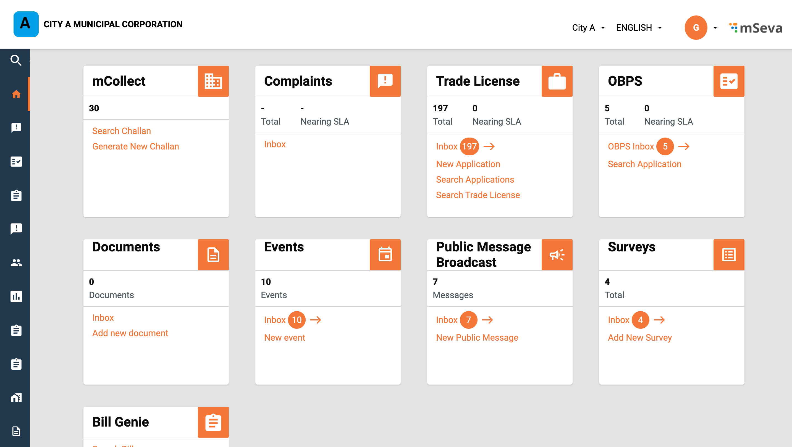

# MCS Employee User Manual

## **CE And FE** 

The counter employees or field employees collect and process the miscellaneous payments on behalf of the citizens.

**The CE or FE role can -**

* [Generate challan](mcs-employee-user-manual.md#collect-payment)
* [Make payment](mcs-employee-user-manual.md#make-payment)
* [Search challan](mcs-employee-user-manual.md#search-challan)

### **Generate Challan** 

CE can process and collect payments for miscellaneous services through the DIGIT web portal or the DIGIT mobile app. To process a new payment, click the **mCollect** card on the employee home screen. Click on **Generate New Challan** button.

<figure><figcaption></figcaption></figure>

On the **New Challan** page, enter the **Consumer Details** and **Service Details**.&#x20;

<figure><figcaption></figcaption></figure>

Click on **Submit** button at the bottom of the page. The success message screen pops with the **Challan No.** Click on the **Print Challan** option to print the challan.

<figure><figcaption></figcaption></figure>

Click on **Proceed to Payment** button to make the payment.

## Make Payment

The **Generate Receipt** page displays the payment information details. Enter the **Payer Details**. Select the **Payment Mode**.

<figure><figcaption></figcaption></figure>

Enter the **Gen/G8 Receipt Details**, in case the receipt is generated manually. Click on the **Collect Payment** button at the bottom of the screen to register payment details.&#x20;

<figure><figcaption></figcaption></figure>

The success message is displayed. Click on **Print Receipt** to print the receipt.&#x20;

### Search Challan

Click on **Search Challan** option on the employee home page.&#x20;

<figure><figcaption></figcaption></figure>

Select the required filters and click on the **Search** button. The results will be displayed on the page.

<figure><figcaption></figcaption></figure>

