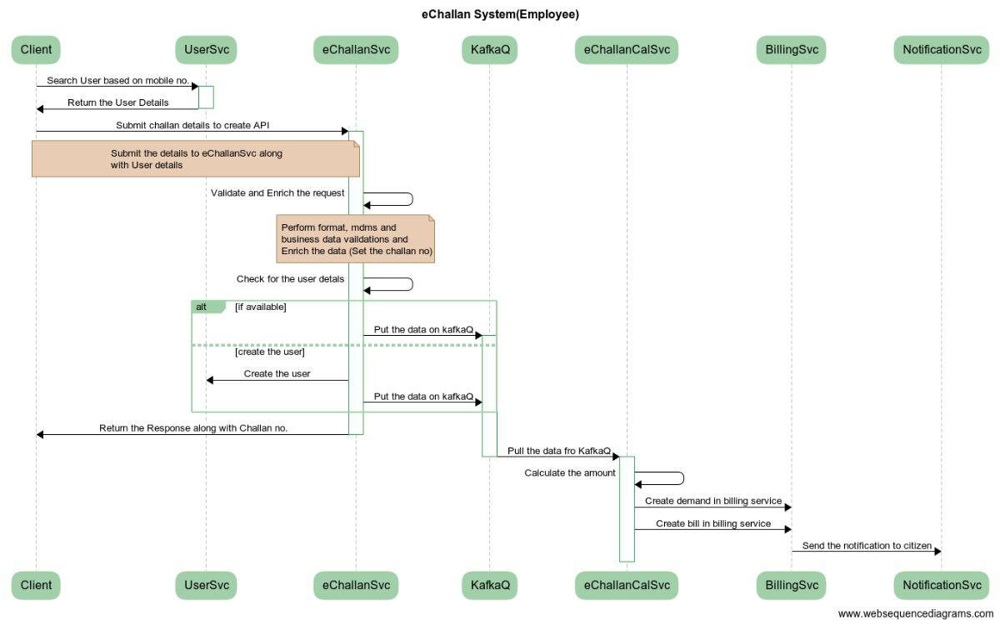

# e-Challan Service

## Overview

eChallan system enables employees to generate the challans for Adhoc services so that the payment can be recorded into the system along with service-specific details.

It also enables citizens to make payments online based on challan no.

## Pre-requisites

Before you proceed with the documentation, make sure the following pre-requisites are met -

* _Java 8_
* Kafka server is up and running
* egov-persister service is running and has workflow persister config path added in it
* PSQL server is running and a database is created to store workflow configuration and data

## Key Functionalities

* Allow the employee to capture service details for miscellaneous services and collect payment
* Allow the employee to update / cancel challan.
* Search, download, and print echallan / bill for miscellaneous service
* Generate and view echallan / bill pdf for all miscellaneous and ad-hoc services
* Send SMS and an email bill notification to the citizen with a payment link and bill link

## Interaction Diagram




## Configuration Details <a href="#configuration-details" id="configuration-details"></a>

**MDMS Configuration**


#### Actions & Role Action Mapping <a href="#actions-and-role-action-mapping" id="actions-and-role-action-mapping"></a>

\
**Actions**

```
[
   {
      "id": {{PLACEHOLDER1}},
      "name": "Expense Create",
      "url": "/echallan-services/eChallan/v1/_create",
      "parentModule": "",
      "displayName": "EChallan Create",
      "orderNumber": 0,
      "enabled": false,
      "serviceCode": "echallan-services",
      "code": "null",
      "path": ""
    },
    {
      "id": {{PLACEHOLDER2}},
      "name": "Expense Search",
      "url": "/echallan-services/eChallan/v1/_search",
      "parentModule": "",
      "displayName": "EChallan Create",
      "orderNumber": 0,
      "enabled": false,
      "serviceCode": "echallan-services",
      "code": "null",
      "path": ""
    },
    {
      "id": {{PLACEHOLDER3}},
      "name": "Expense Update",
      "url": "/echallan-services/eChallan/v1/_update",
      "parentModule": "",
      "displayName": "EChallan Create",
      "orderNumber": 0,
      "enabled": false,
      "serviceCode": "echallan-services",
      "code": "null",
      "path": ""
    },
    {
      "id": {{PLACEHOLDER4}},
      "name": "Vendor Create",
      "url": "/vedor/v1/_create",
      "parentModule": "",
      "displayName": "Vendor Create",
      "orderNumber": 0,
      "enabled": false,
      "serviceCode": "vendor",
      "code": "null",
      "path": ""
    },
    {
      "id": {{PLACEHOLDER5}},
      "name": "Vendor Search",
      "url": "/vendor/v1/_search",
      "parentModule": "",
      "displayName": "Vendor Create",
      "orderNumber": 0,
      "enabled": false,
      "serviceCode": "vendor",
      "code": "null",
      "path": ""
    },
     {
      "id": 2007,
      "name": "Update Password",
      "url": "/user/password/_update",
      "parentModule": "",
      "displayName": "Password Update",
      "orderNumber": 4,
      "enabled": false,
      "serviceCode": "ADMIN",
      "code": "null",
      "path": ""
    },
]


```

**Role Action Mapping**

```
[
  {
      "rolecode": "EXPENSE_PROCESSING",
      "actionid": {{PLACEHOLDER1}},
      "actioncode": "",
      "tenantId": "pb"
    },
    {
      "rolecode": "EXPENSE_PROCESSING",
      "actionid": {{PLACEHOLDER2}},
      "actioncode": "",
      "tenantId": "pb"
    },
    {
      "rolecode": "DASHBOARD_VIEWER",
      "actionid": {{PLACEHOLDER2}},
      "actioncode": "",
      "tenantId": "pb"
    },
    {
      "rolecode": "GP_ADMIN",
      "actionid": {{PLACEHOLDER2}},
      "actioncode": "",
      "tenantId": "pb"
    },
    {
      "rolecode": "EXPENSE_PROCESSING",
      "actionid": {{PLACEHOLDER3}},
      "actioncode": "",
      "tenantId": "pb"
    },
    {
      "rolecode": "SUPERUSER",
      "actionid": {{PLACEHOLDER4}},
      "actioncode": "",
      "tenantId": "pb"
    },
    {
      "rolecode": "EXPENSE_PROCESSING",
      "actionid": {{PLACEHOLDER4}},
      "actioncode": "",
      "tenantId": "pb"
    },
    {
      "rolecode": "EXPENSE_PROCESSING",
      "actionid": {{PLACEHOLDER5}},
      "actioncode": "",
      "tenantId": "pb"
    },
    {
      "rolecode": "SUPERUSER",
      "actionid": {{PLACEHOLDER5}},
      "actioncode": "",
      "tenantId": "pb"
    },
    {
      "rolecode": "SUPERUSER",
      "actionid": {{PLACEHOLDER6}},
      "actioncode": "",
      "tenantId": "pb"
    },
    {
      "rolecode": "GP_ADMIN",
      "actionid": {{PLACEHOLDER6}},
      "actioncode": "",
      "tenantId": "pb"
    },
    {
      "rolecode": "COLLECTION_OPERATOR",
      "actionid": {{PLACEHOLDER6}},
      "actioncode": "",
      "tenantId": "pb"
    },
    {
      "rolecode": "BULK_DEMAND_PROCESSING",
      "actionid": {{PLACEHOLDER6}},
      "actioncode": "",
      "tenantId": "pb"
    },
    {
      "rolecode": "EXPENSE_PROCESSING",
      "actionid": {{PLACEHOLDER6}},
      "actioncode": "",
      "tenantId": "pb"
    },
    {
      "rolecode": "DASHBOARD_VIEWER",
      "actionid": {{PLACEHOLDER6}},
      "actioncode": "",
      "tenantId": "pb"
    },
    {
      "rolecode": "PROFILE_UPDATE",
      "actionid": {{PLACEHOLDER6}},
      "actioncode": "",
      "tenantId": "pb"
    },
]


```

Roles to be available:

```
		{
      "code": "GP_ADMIN",
      "name": "GP Admin",
      "description": "Who has a access to ws-services"
    },
		{
      "code": "COLLECTION_OPERATOR",
      "name": "Collection Operator",
      "description": "Who has a access to ws-services,demand, bill and payment"
    },
		{
      "code": "BULK_DEMAND_PROCESSING",
      "name": "Bulk Demand Processing",
      "description": "Who has a access to bulk demand generation,raise bill, downloa bill and receipts"
    },
		{
      "code": "EXPENSE_PROCESSING",
      "name": "Expense Processing",
      "description": "Who has a access to create and update expenses"
    },
		{
      "code": "DASHBOARD_VIEWER",
      "name": "Dashbaord Viewer",
      "description": "Who has a access to dashboard of revenue and expenditure"
    }
```

#### Localization <a href="#localization" id="localization"></a>

```
{
  "messages": [
        {
            "code": "echallan.cancel.sms",
            "message": "Challan No: <challanno> for <service> has been cancelled.",
            "module": "rainmaker-uc",
            "locale": "en_IN"
        },
        {
            "code": "echallan.create.sms",
            "message": "Challan No: <challanno> for <service> INR <amount> generated. Pay @ <Link> .",
            "module": "rainmaker-uc",
            "locale": "en_IN"
        },
        {
            "code": "echallan.update.sms",
            "message": "Challan No: <challanno> updated for <service>. Amount INR <amount>. Pay @ <Link> .",
            "module": "rainmaker-uc",
            "locale": "en_IN"
        }
  ]
}
```

## Deployment Details

1. Add MDMS configs required for eChallan Service and calculator and restart MDMS service
2. Deploy the latest version of eChallan Service and calculator
3. Add eChallan Service persister yaml path in persister configuration and restart persister service
4. Add Role-Action mapping for API’s
5. Add pdf configuration file for challan and bill

## Integration <a href="#integration" id="integration"></a>

### Integration Scope

The eChallan service is used to generate **e-challans / bill** for all miscellaneous / adhoc services which citizens avail from ULBs.

### Integration Benefits

* Can perform service-specific business logic without impacting the other module.
* Provides the capability of capturing the unique identifier of the entity for which the challan is generated.
* In the future, if we want to expose the application to citizens then it can be done easily.
* Workflows or Service-specific workflows can be enabled at the challan service level at any time without changing the design.
* Allow an employee to update / cancel challan

### Steps to Integration

1. To integrate, a host of echallan-services modules should be overwritten in the helm chart.
2. echallan-services/eChallan/v1/\_create should be added as the create endpoint for creating eChallan in the system
3. echallan-services/eChallan/v1/\_search should be added as the search endpoint. This method handles all requests to search existing records depending on different search criteria
4. echallan-services/eChallan/v1/\_update should be added as the update endpoint. This method is used to update fields in existing records or to update the status of the application based on workflow.

## Reference Docs

#### Doc Links <a href="#doc-links" id="doc-links"></a>

| Title                     | Link                                                                                                                                                            |
| ------------------------- | --------------------------------------------------------------------------------------------------------------------------------------------------------------- |
| API Swagger Documentation | [Swagger Documentation](https://editor.swagger.io/?url=https://raw.githubusercontent.com/egovernments/municipal-services/develop/docs/e-Challan-v1.0.0.yaml#!/) |

#### API List <a href="#api-list" id="api-list"></a>

| Title                                    | Link                                                                                                                       |
| ---------------------------------------- | -------------------------------------------------------------------------------------------------------------------------- |
| _echallan-services/eChallan/v1/\_create_ | [https://www.getpostman.com/collections/349413e52bf743d50b0a](https://www.getpostman.com/collections/349413e52bf743d50b0a) |
| _echallan-services/eChallan/v1/\_update_ | [https://www.getpostman.com/collections/349413e52bf743d50b0a](https://www.getpostman.com/collections/349413e52bf743d50b0a) |
| _echallan-services/eChallan/v1/\_search_ | [https://www.getpostman.com/collections/349413e52bf743d50b0a](https://www.getpostman.com/collections/349413e52bf743d50b0a) |
| _echallan-services/eChallan/v1/\_count_  | [https://www.getpostman.com/collections/773565d7b5866f0851e3](https://www.getpostman.com/collections/773565d7b5866f0851e3) |

_(Note: All the APIs are in the same postman collection therefore the same link is added in each row)_


> [](http://creativecommons.org/licenses/by/4.0/)_All content on this page by_ [_eGov Foundation_](https://egov.org.in/) _is licensed under a_ [_Creative Commons Attribution 4.0 International License_](http://creativecommons.org/licenses/by/4.0/)_._
