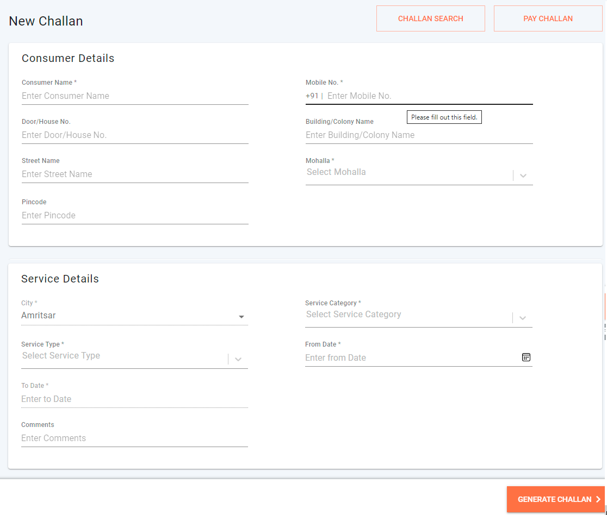
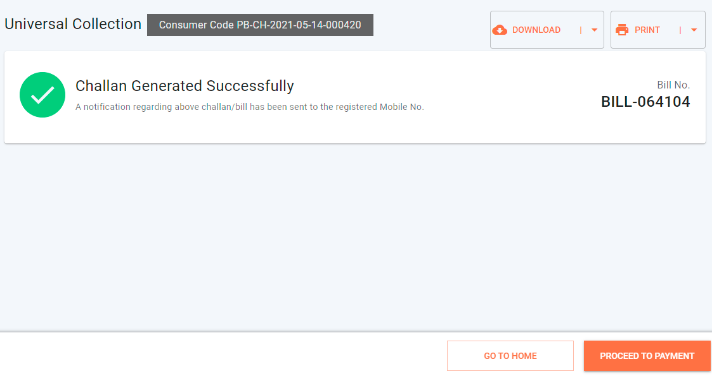

# e-Challan UI Details

## Overview

This page offers a detailed insight into the user interface features, screens, and navigation available for the eChallan service in the mCollect module. Browse through this document to find the e-Challan service details, MDMS and localization details.

**Objective**

1. Generate **e-challans / bills** for all miscellaneous / Adhoc services which citizens avail from ULBs
2. The ability for ULBs to Notify citizens about outstanding payments - Online and offline
3. Enable Digital payments for citizens - QR code, payment link in notifications, etc.

Employees can Create Challan, by selecting the service category, and entering all consumer information and tax head details.

## **mCollect - Create Challan**



Click here to find the [create new challan file changes](https://github.com/egovernments/frontend/blob/39ffbeb4f5446bbb08729e9ce6cf0d519f2f748c/web/rainmaker/dev-packages/egov-uc-dev/src/ui-config/screens/specs/uc/newCollection.js).

Selecting City is disabled as UC Employee of City A should be able to access/create only City A-related challans.

## **MDMS Details**

```
{
  "tenantId": "pb.amritsar",
  "moduleDetails": [
    {
      "moduleName": "BillingService",
      "masterDetails": [
        {
          "name": "BusinessService",
          "filter": "[?(@.type=='Adhoc')]"
        },
        {
        "name":"TaxPeriod"
        }
      ]
    },
    {
      "moduleName": "common-masters",
      "masterDetails": [
        {
          "name": "uiCommonPay"
        }
      ]
    }
  ]
}
```

### **Service Type and Service Category Dropdown Formation**

Based on the response, Service Type and Service category Dropdowns are Loaded.\
For eg: Refer to the response object

```
{
  "businessService": "WaterCharges.Metered",
  "code": "WaterCharges.Metered",
  "collectionModesNotAllowed": [
    "DD"
  ],
  "partPaymentAllowed": false,
  "isAdvanceAllowed": true,
  "demandUpdateTime": 86400000,
  "isVoucherCreationEnabled": false,
  "type": "Adhoc"
}
```

Based on that `"businessService": "WaterCharges.Metered"`

The service Category is `"WaterCharges"` and the service Type is `"Metered"`\
The conversion of business Service utils is `setServiceCategory` method present in \`\`[https://github.com/egovernments/frontend/blob/39ffbeb4f5446bbb08729e9ce6cf0d519f2f748c/web/rainmaker/dev-packages/egov-uc-dev/src/ui-config/screens/specs/utils/index.js](https://github.com/egovernments/frontend/blob/39ffbeb4f5446bbb08729e9ce6cf0d519f2f748c/web/rainmaker/dev-packages/egov-uc-dev/src/ui-config/screens/specs/utils/index.js)

### **Tax Head Dropdown Formation**

Based on the MDMS response `TaxHeadMaster` are formed by the selected service type dropdown.

Filter the initial Taxhead master with the selected service type with `service` attribute in each Taxheads.

**Other Validations and Create challan** can be referred to in [https://github.com/egovernments/frontend/blob/39ffbeb4f5446bbb08729e9ce6cf0d519f2f748c/web/rainmaker/dev-packages/egov-uc-dev/src/ui-config/screens/specs/uc/newCollectionResource/newCollectionFooter.js](https://github.com/egovernments/frontend/blob/39ffbeb4f5446bbb08729e9ce6cf0d519f2f748c/web/rainmaker/dev-packages/egov-uc-dev/src/ui-config/screens/specs/uc/newCollectionResource/newCollectionFooter.js)

`createChallan` method is used to create challan.

`/echallan-services/eChallan/v1/_create` API is used to create a challan.

Users will be able to see the Challan Acknowledgement once the Challan is created successfully,

Actions available:

1. Proceed to Payment
2. Download/print Challan
3. Navigate back to the Home page



Challan’s can be downloaded through this API `egov-pdf/download/UC/mcollect-challan?challanNo=`

## **Localisation Module**

`rainmaker-uc`

**API Used**

1. `egov-mdms-service/v1/_search`
2. `echallan-services/eChallan/v1/_create`
3. `egov-pdf/download/UC/mcollect-challan`

## **Role Action Mapping**

| API                                     | Roles   | Action ID |
| --------------------------------------- | ------- | --------- |
| `egov-mdms-service/v1/_search`          |         | 954       |
| `echallan-services/eChallan/v1/_create` | UC\_EMP | 2112      |
| `egov-pdf/download/UC/mcollect-challan` | UC\_EMP | 2115      |

## **Document Resources and Links**

| Related Title                  | Documentation                                                                              |
| ------------------------------ | ------------------------------------------------------------------------------------------ |
| MCollect Search Challan        | [Search Challan and Pay Challan](search-and-pay-challan.md)                                |
| MCollect Pay Challan           | [BillGenie](https://digit-discuss.atlassian.net/wiki/spaces/EGR/pages/436502610/BillGenie) |
| MCollect Edit / Update Challan | [Edit/Cancel Challan](edit-cancel-challan.md)                                              |

[​](http://creativecommons.org/licenses/by/4.0/)All content on this page by [eGov Foundation](https://egov.org.in/) is licensed under a [Creative Commons Attribution 4.0 International License](http://creativecommons.org/licenses/by/4.0/).
