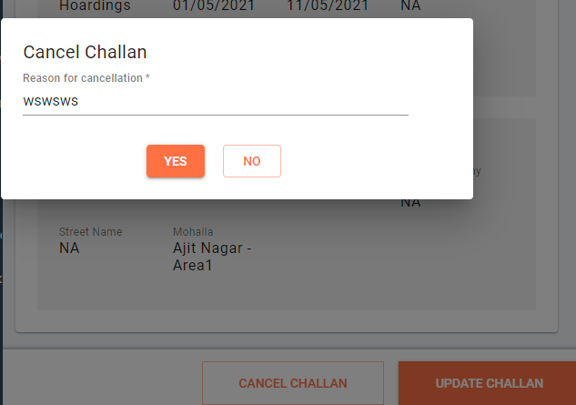

# Edit - Cancel Challan

## Overview

This document provides details about the edit challan feature in the mCollect module. Challans are created using create challan option explained in the [eChallan UI Details](./) page.

The edit challan workflow enables users to make any correction in the challan or even cancel created challans.

## Edit Challan

Use the search tool to find the relevant challan and edit it. The Search and Pay Challan page provides information on how to use the search tool.

Click on the search result to navigate to the view challan screen. The service details are [available here](https://github.com/egovernments/frontend/blob/39ffbeb4f5446bbb08729e9ce6cf0d519f2f748c/web/rainmaker/dev-packages/egov-uc-dev/src/ui-config/screens/specs/uc/search-preview.js).

Here we use `echallan-services/eChallan/v1/_search` API to get the Challan Information and`billing-service/bill/v2/_search`to the tax head breakup information. Download/Print using `egov-pdf/download/UC/mcollect-challan` API.

**Actions**

1. Update challan to edit
2. Cancel challan

### **Cancel Challan**

To cancel challan, click on cancel and enter the reason for cancellation. This action calls the `echallan-services/eChallan/v1/_update` API to cancel.

### **Update challan**

Update challan can be used to edit only Tax head information. Any other information that is freezed, can be changed accordingly to support the requirement.

Once you click on update challan `echallan-services/eChallan/v1/_update?` API will be called and the challan will be updated accordingly.

## **Localisation Module**

rainmaker-uc

**API Used**

1. egov-mdms-service/v1/\_search
2. echallan-services/eChallan/v1/\_update
3. egov-pdf/download/UC/mcollect-challan
4. echallan-services/eChallan/v1/\_search
5. billing-service/bill/v2/\_search

## **Role Action Mapping**

| API                                    | Roles   | Action ID |
| -------------------------------------- | ------- | --------- |
| egov-mdms-service/v1/\_search          |         | 954       |
| echallan-services/eChallan/v1/\_update | UC\_EMP | 2117      |
| egov-pdf/download/UC/mcollect-challan  | UC\_EMP | 2115      |
| echallan-services/eChallan/v1/\_search | UC\_EMP | 2114      |
| billing-service/bill/v2/\_search       |         | 1861      |

## **Documents and Resources Links**

| Related Title           | Documentation                                                                              |
| ----------------------- | ------------------------------------------------------------------------------------------ |
| MCollect Create Challan | [eChallan - Technical Documentation](./)                                                   |
| MCollect Search Challan | [Search Challan and Pay Challan](search-and-pay-challan.md)                                |
| MCollect Pay Challan    | [BillGenie](https://digit-discuss.atlassian.net/wiki/spaces/EGR/pages/436502610/BillGenie) |

[​](http://creativecommons.org/licenses/by/4.0/)All content on this page by [eGov Foundation](https://egov.org.in/) is licensed under a [Creative Commons Attribution 4.0 International License](http://creativecommons.org/licenses/by/4.0/).
