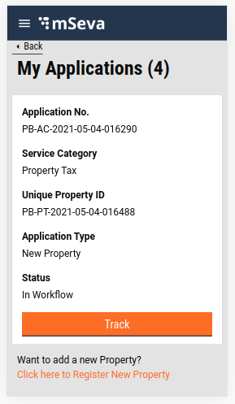
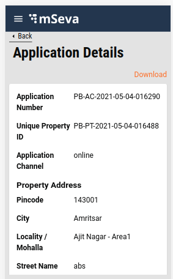
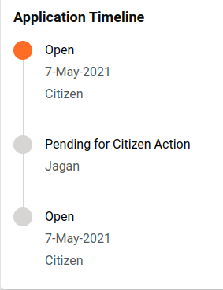

# Property Tax - My Applications

**Objective:** Users can review the list of applications and their status registered under their mobile number in the My Applications tab.&#x20;

Initially, only four applications are loaded on the screen. The user can click on the Load More option to view more applications. Each application displays the Application Number, Service Category, Property Id, Application Type and Status details along with the Track option. This enables the user to find more details about the application. If users are unable to find their property details on the system, a new application can be created using the link provided at the bottom of the page.



Once the user clicks on the Track button, the Application Details page is displayed with all the necessary information about the application.



**Timeline component:** The timeline component is available at the end of the application details. This provides the details on the current status and history of the application passing through various workflows and actions taken.



## **Technical Implementation Details**

[Click here to fetch the working code](https://github.com/egovernments/digit-ui-internals/blob/development/packages/modules/pt/src/pages/citizen/PTMyApplications/index.js) details for My Applications and Application Details common Index.

The template for My Application is present under pt/pages/citizen/PTMyApplications and the Application Details page is present inside pt/pages/citizen named as PTApplicationDetails. The list of applications is retrieved by calling the search API "/property-services/property/\_search".

This API is called using the React hook present inside the index of PTMyapplication and PTApplicationDetails page. A single application is loaded bypassing the unique Property Id in the search API.

Following is the hook used for the property search API.

```
const { isLoading, isError, error, data } = Digit.Hooks.pt.usePropertySearch(tenantId);
```

### **Create and Update Util Function**

The two main util functions and their objectives are given below:

Create Util Function: While going through the Create flow, all the inputs provided by the user are stored in a different structure. Since the units are not separated in the flow but incorporated into distinct categories, the storing structure is different from the request body of Create API. This function transforms the flow of stored data into the requested body format.

[Click here](https://github.com/egovernments/digit-ui-internals/tree/development/packages/modules/pt/src/utils) to fetch the code.

[Update Util Function: ](edit-update-property.md)Click here to find detailed information about this function.

## **MDMS**

No MDMS data is used here - all the data is loaded from the Search API.

## **Localization**

For My Applications, the localization keys are added to the ‘_rainmaker-pt_’ locale module same as in My Properties and Create Property. Any changes, updates or addition of any new localization key is done in the same locale module.

## Role Action Mapping


| **Url**                                             | **Roles**               | **Action Id** |
| --------------------------------------------------- | ----------------------- | ------------- |
| `egov-workflow-v2/egov-wf/process/_search`          | `PTCEMP,FI,APPROVER,DV` | `1730`        |
| `/property-services/property/_search`               | `PTCEMP,FI,APPROVER,DV` | `1897`        |
| `/egov-workflow-v2/egov-wf/businessservice/_search` | `PTCEMP,FI,APPROVER,DV` | `1743`        |
| `/filestore/v1/files/url`                           | `PTCEMP,FI,APPROVER,DV` | `1528`        |


> [\_\_](http://creativecommons.org/licenses/by/4.0/)_All content on this page by_ [_eGov Foundation_ ](https://egov.org.in/)_is licensed under a_ [_Creative Commons Attribution 4.0 International License_](http://creativecommons.org/licenses/by/4.0/)
