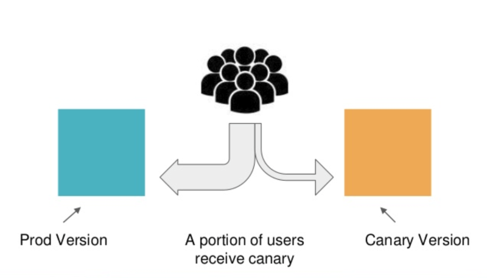
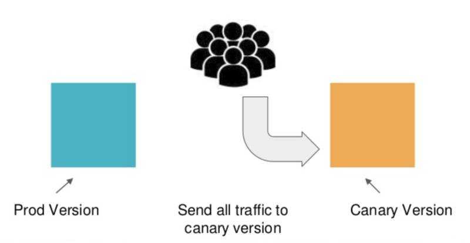

# Canary Deployment

It is a deployment strategy which uses [Canaries](https://martinfowler.com/bliki/CanaryRelease.html) (a.k.a. incremental rollouts). With canaries, the new version of the application is gradually deployed to the Kubernetes cluster while getting a very small amount of live traffic (i.e. a subset of live users are connecting to the new version while the rest are still using the previous version).



The small subset of live traffic to the new version acts as an early warning for potential problems that might be present in the new code. As our confidence increases, more canaries are created and more users are now connecting to the updated version. In the end, all live traffic goes to canaries, and thus the canary version becomes the new “production version”.



The big advantage of using canaries is that deployment issues can be detected very early while they still affect only a small subset of all application users. If something goes wrong with a canary, the production version is still present and all traffic can simply be reverted to it.

While a canary is active, you can use it for additional verification (for example running smoke tests) to further increase your confidence on the stability of each new version.

## How to Achieve this?&#x20;

To achieve the Canary Deployment Strategy we use Flagger - a progressive delivery tool that automates the release process for applications running on Kubernetes. It reduces the risk of introducing a new software version in production by gradually shifting traffic to the new version while measuring metrics and running conformance tests.

## Prerequisites

Flagger requires a Kubernetes cluster **v1.16** or newer.

We need Linkerd and Linkerd Viz installed on our cluster to automate and monitor our Canary Deployments.  Follow the [Installing Linkerd Guide](https://linkerd.io/2.10/tasks/install/) to install Linkerd and Linkerd Viz.

Install Flagger&#x20;

```bash
kubectl apply -k github.com/fluxcd/flagger//kustomize/linkerd
```

##


