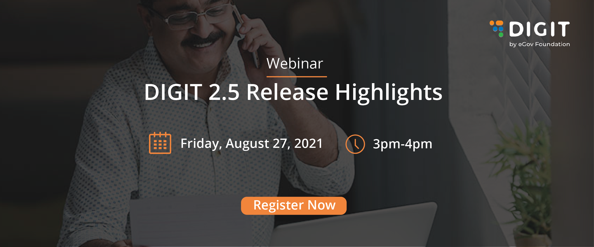

# Open Events

We have organized an interactive webinar session to walk you through the new developments on the DIGIT platform. The session will also address any queries you may have in context to the release features and platform upgrades.

​[**Register NOW!**](https://us02web.zoom.us/webinar/register/WN_jFSs1OVZSKmV6JI4bZ37aA)**​**

> **Business Heads, Program Managers, Business Analysts, Solution Architects, and DevOps Engineers** will find this session useful.

We are excited to have you join us for this event. In the meantime, we thought that our [docs](https://egovernments.us15.list-manage.com/track/click?u=1c3d4853edcca0a9bf558e692&id=9e20321688&e=f5762a60cb) and resources around the release highlights might be helpful for you to learn more about the features.

* [​DIGIT 2.5 Release Notes​](../digit-release-notes/)
* [Service Build Updates - DIGIT 2.5](https://egovernments.us15.list-manage.com/track/click?u=1c3d4853edcca0a9bf558e692&id=ab498fbf9d&e=4c64d3dbfc)
* [MDMS & Configuration Updates - DIGIT 2.5](https://egovernments.us15.list-manage.com/track/click?u=1c3d4853edcca0a9bf558e692&id=9f0dca6c7f&e=4c64d3dbfc)
* [Test Cases For DIGIT 2.5 Release](https://egovernments.us15.list-manage.com/track/click?u=1c3d4853edcca0a9bf558e692&id=740f80d672&e=4c64d3dbfc)
* [WhatsApp v2 Enhancements Release Notes 2.5](https://egovernments.us15.list-manage.com/track/click?u=1c3d4853edcca0a9bf558e692&id=a1f1e0a030&e=4c64d3dbfc)
* [Trade License Ui/UX Revamp Release Notes 2.5](https://egovernments.us15.list-manage.com/track/click?u=1c3d4853edcca0a9bf558e692&id=a1fc98c9f7&e=4c64d3dbfc)
* [FSM DSS and Reports Release Notes 2.5](https://egovernments.us15.list-manage.com/track/click?u=1c3d4853edcca0a9bf558e692&id=0853355362&e=4c64d3dbfc)
* [HRMS UI/UX Revamp Release Notes 2.5](https://egovernments.us15.list-manage.com/track/click?u=1c3d4853edcca0a9bf558e692&id=f364b22501&e=4c64d3dbfc)
* [Workflow Auto Escalation Release Notes 2.5](https://egovernments.us15.list-manage.com/track/click?u=1c3d4853edcca0a9bf558e692&id=8b1983a6fd&e=4c64d3dbfc)
* [W&S Enhancements Release Notes 2.5](https://egovernments.us15.list-manage.com/track/click?u=1c3d4853edcca0a9bf558e692&id=7441da6a05&e=4c64d3dbfc)
* [Bill Amendments Enhancements Release Notes 2.5](https://egovernments.us15.list-manage.com/track/click?u=1c3d4853edcca0a9bf558e692&id=606ba6102b&e=4c64d3dbfc)
* [QA Automation Release Notes 2.5](https://egovernments.us15.list-manage.com/track/click?u=1c3d4853edcca0a9bf558e692&id=86ef8e6252&e=4c64d3dbfc)

**Click here to** [**Register**](https://us02web.zoom.us/webinar/register/WN_5-Rv0o_sRsapJqchd8DEfg) **for the event.**

