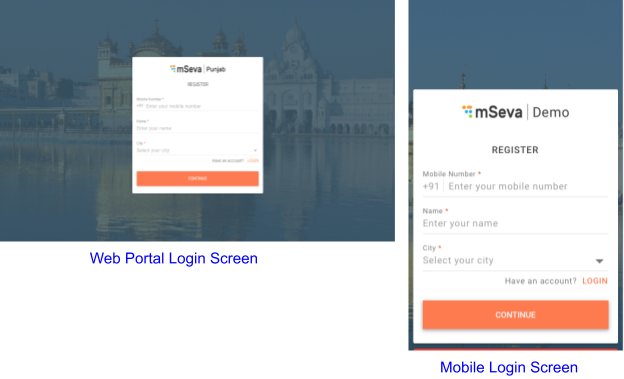
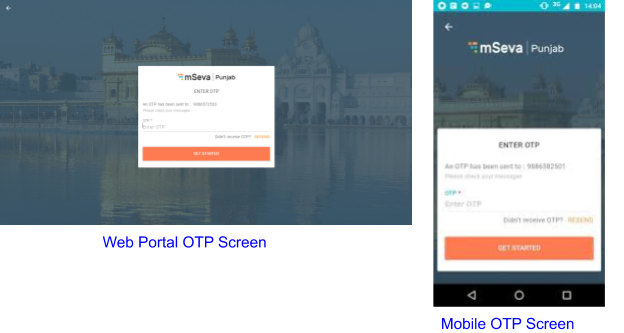
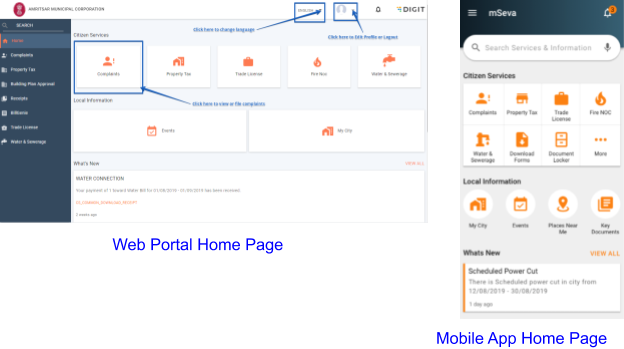
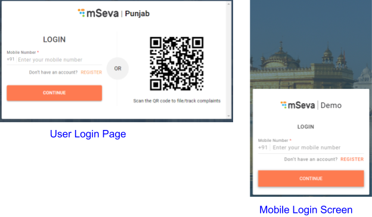
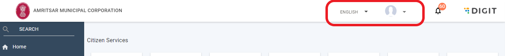

# Logging In To DIGIT

DIGIT users can sign up to use various modules through the online web portal or the mobile application login interface.

#### User Registration

The first step to logging in to use the **DIGIT** modules is to register as a user.

To register as a user 

1. Enter the ULB url in your browser. For instance, people of Punjab will use the link [https://mseva.lgpunjab.gov.in/citizen/user/register](https://mseva.lgpunjab.gov.in/citizen/user/register) to register for Punjab mSeva services.  
2. Enter your **Mobile Number** to register as a user.
3. Enter your **Name**.
4. Select your city from the **City** drop-down list.
5. Click on the **Continue** button. 
6. The system sends an OTP to your mobile number. Enter the **OTP**.  
7. Click on the **Resend** button on the screen in case you have not received your OTP.
8. Click on the **Get Started** button.
9. You are registered as a user in the mSeva app.  

#### User Login

To log in to the system

1. Enter the url [https://egov-micro-qa.egovernments.org/citizen/](https://egov-micro-qa.egovernments.org/citizen/)
2. Click on the **Login** button.
3. Enter your **Mobile Number**.
4. Mobile app users can scan the QR code on the screen to file/track complaints.  
5. Click on the **Continue** button.
6. Enter the **OTP** sent to the registered mobile number.
7. Click on the **Continue** button.

You are logged in to the app.  

#### Edit User Profile

To change your account details

1. Click on the drop-down icon next to your profile logo on the top right corner of the window.
2. Click on **Edit Profile**.  
3. Enter your new user **Name** if you want to change the existing profile name.
4. Select the applicable **City** from the drop-down list if you want to change your city settings.
5. Enter your **Email Id** if you want to reset your email address.
6. Click on the camera   icon to upload or change your Profile photo.
7. Click on the **Gallery** button to select an image from your photo gallery or files on the computer.  
8. Select the file and click on the **Open** button. This will load the selected image as the profile picture.
9. Click on the **Remove** button to delete the existing profile picture.
10. Click on the **Save** button.

The profile changes are saved and applied.  

#### Change Language Settings

Users can change the language of the app from English to Hindi or the local language for ease and convenience.

To change language

1. Click on the button labelled English adjacent to the profile icon.  
2. Select the preferred language from the list of available languages.

The system menu and prompts will now be displayed in the selected language.  

#### Logging Out

To log out from the app 

1. Click on the drop-down icon next to your profile logo on the top right corner of the window.
2. Click on Logout.

You are logged out of the system.  

