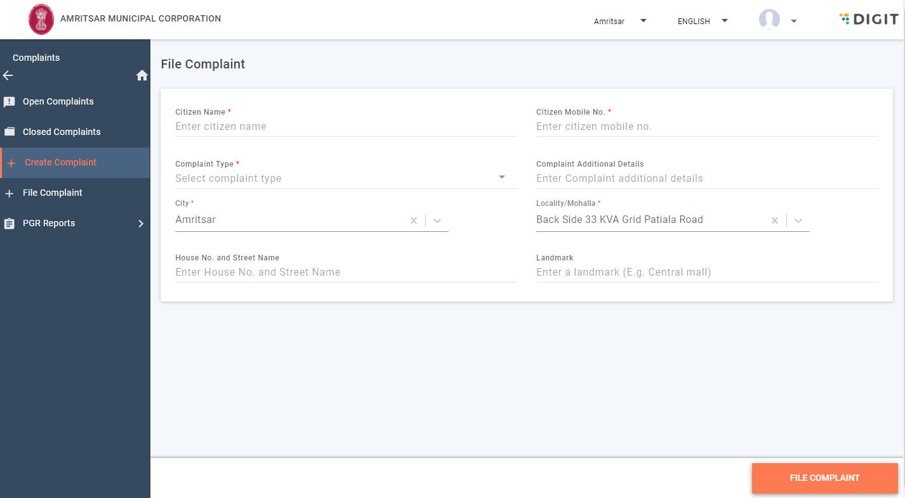
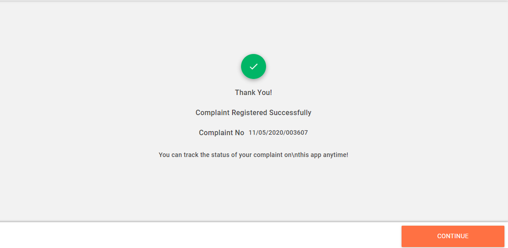

# Employee User Manual

Citizen complaints are routed through different workflows. The workflows represent a methodical and rational approach to complaint resolution.

These workflows include -

* File Complaints
* Search Complaints
* Reopen Complaints
* Assign Complaints
* Re-Assign Complaints
* Share Complaints
* Reject Complaints
* Resolve Complaints

### File Complaints

To file complaints on behalf of the citizen

1. Navigate to the Home page and click on the **Complaints** card.
2. Else, click on the **Complaints** menu option in the sidebar.
3. Click on the **File Complaint** tab on the screen. This will open the complaint form page.  
4. Enter the **Citizen Name**.  
5. Enter **Citizen Mobile No.**
6. Select the relevant **Complaint Type** and the subtype from the drop-down list of options. Refer to the list of complaint types available in PGR.
7. Enter any additional information in the **Complaint Additional Details** field.
8. The **City** field will display the city specified in your profile by default. You can change the city if required.
9. Choose the applicable **Locality/Mohalla** from the drop-down list.
10. Enter the **House No.** and **Street Name**.
11. Enter any **Landmark** to identify the exact location for the listed complaint. 
12. Click on **File Complaint** button once you have finished filling in all the details.
13. The system will display the Complaint Registered Successfully message along with the Complaint No.  
14. Click on the **Continue** button. Your complaint details are available on the dashboard.
15. Click on the complaint to view the complaint details.

### Search Complaints

### Reopen Complaints

### Assign Complaints

### Re-Assign Complaints

### Share Complaints

### Reject Complaints

### Resolve Complaints

